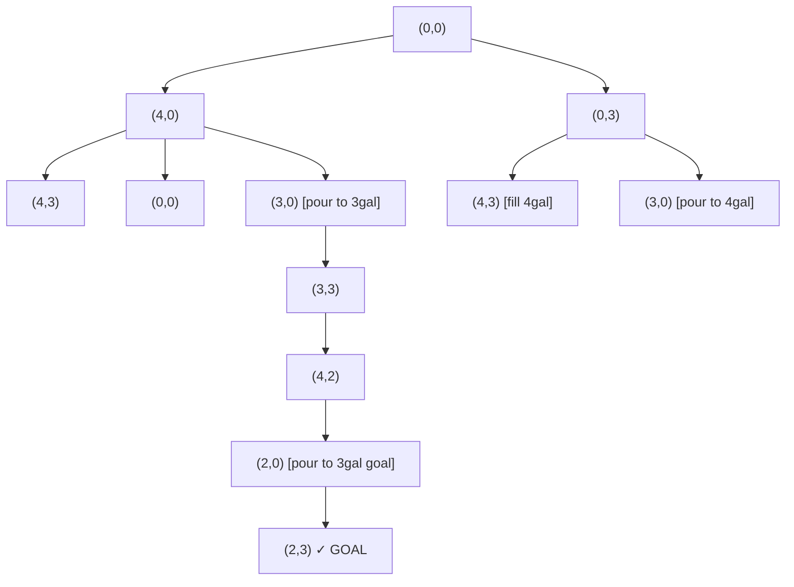
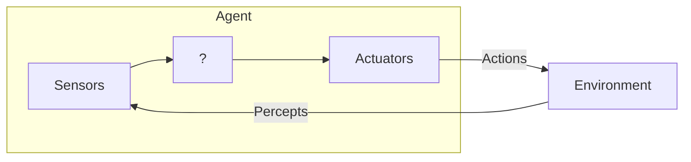
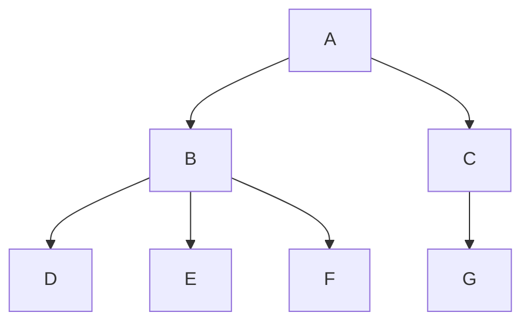
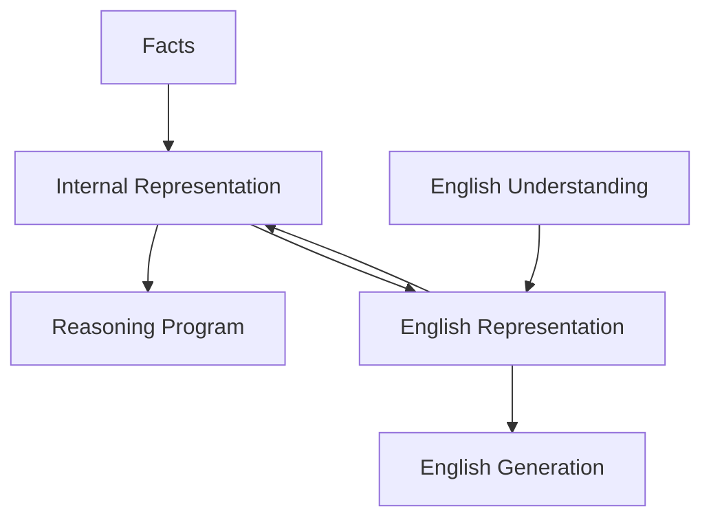

# Artificial Intelligence — Lecture Notes

### What is Intelligence?

> **Intelligence** is defined as "the capacity to think and comprehend the world in an elaborate way, involving knowledge, experience and understanding."

- Machines are better than humans in some tasks such as computation, addition and subtraction etc., but struggle with creative tasks that humans do normally.
- AI is concerned with understanding human cognition and building entities that have at least human-level cognition — in other words, to do the creative things that humans do but **FASTER**.

### Limits of Computational Power

For humans performing a task requires learning in a natural order:
- **First** — Perception, linguistics, Common Sense
- **Later** — Engineering, medicine, finance etc.

The individual (formal) task requires much less knowledge to represent in a computer system than the mundane tasks.

### Mundane vs Formal Tasks

| Mundane Task             | Formal Task  |
|--------------------------|--------------|
| Perception               | Games        |
| Vision                   | Chess        |
| Speech                   | Backgammon   |
| Natural Language         | Checkers     |
| Understanding            | Mathematics  |
| Generation               | Generation   |
| Translation              | Logic        |
| Common Sense Reasoning   | Calculus     |
| Robot Control            | Proof        |

---

## The Water Jug Problem

You are given two jugs: a **4-gallon** one and a **3-gallon** one. Neither has any measuring markers. There is a tap that can be used to fill the jugs with water. How can you get exactly **2 gallons** of water into the 4-gallon jug?

> NB: This is a **state space problem**.

### Solution

The state space (SS) for this problem can be described as the set of ordered pairs of integers **(x, y)** such that:
- `x = 0, 1, 2, 3, or 4`
- `y = 0, 1, 2, or 3`

Where `x` represents the number of gallons of water in the 4-gallon jug and `y` represents the quantity of water in the 3-gallon jug.

- **Start State:** (0, 0)
- **Goal State:** (2, 3)



---

## The Farmer's Problem

A farmer needs to transport a **Lion**, **Goat**, and **Yam** across a river. The farmer can take only one item across at a time.

### Solution

The state space for the farmer problem is represented with letters **F, L, G, Y** (Farmer, Lion, Goat, Yam).

A bar `|` represents the river. The initial state where farmer, lion, goat and yam are all on one bank is represented as `FLGY|`, and `|FLGY` for the other side.

**State Transition Table:**

| State (Left) | State (Right) |
|---|---|
| `FLGY` | — |
| `FLY` | `G` |
| `FLY` \| `G` → cross goat back | ... |
| ... | ... |
| — | `FLGY` |

> **[Diagram placeholder — see page 6]**
> _Full state-space tree for the farmer problem is in `AI-pages/page-06.png`._

---

## Agent

### Definition

> An **agent** is something that operates automatically, perceives its environment, persists over a prolonged time period, adapts to changes and creates and pursues goals.

> A **rational agent** is one that acts so as to achieve the best outcome or expected outcome when there is uncertainty.

In concrete terms, an agent is anything that can be viewed as **perceiving its environment through sensors** and **acting upon the environment through actuators**.



_Fig 1: An agent intercepts with environment through Sensors and actuators._

### Percept Sequence

- An agent's **percept sequence** is the complete history of everything the agent has ever perceived.
- An agent's choice of actions at any given instant can depend on the built-in knowledge and on the **entire percept sequence** observed to date, but not on anything it has not perceived.
- An agent's behaviour is described by the **agent function** that maps any given percept sequence to an action.
- An agent function is implemented by an **agent program**.
  - **Agent function** — abstract mathematical description
  - **Agent program** — concrete implementation

---

## Rational Agent

A rational agent is one that does the **right thing**. What does it mean to do the right thing?

### Performance Measure

> A rational agent is one that acts so as to achieve the best outcome or expected outcome when there is uncertainty. The notion of best or expected outcome is captured by a **performance measure**.

---

## State Space Search

To build a system to solve a particular problem, we need to do **4 things**:

1. **Define the Problem Precisely.** The definition must include precise specification of what initial situation(s) will be used as well as what the final structure constitutes an acceptable solution to the problem.
   - Example: `FLGY → ?? → FLGY`
   - State: `initial (Si) → goal (Sg)`

2. **Analyse the problem.** A few very important features can have an immense impact on the appropriateness of various possible techniques for solving the problem.

3. **Isolate and represent** the task's knowledge that is necessary to solve the problem.

4. **Choose the best problem-solving technique** and apply it (them) to the particular problem.

> Some problems can be defined as a **STATE SPACE SEARCH**.

Search is a very important process in the solution of hard problems for which no more direct techniques are available.

---

## Types of Search

To search a space there are 2 basic kinds:

1. **Breadth-First Search (BFS)**
2. **Depth-First Search (DFS)**
3. **Best-First Search (BFS/Heuristic)**

Others are derived from BFS and DFS.

### BFS Tree Example



---

## FUNCTION BREADTH-FIRST SEARCH

```
Returns a solution node or failure

node ← NODE(Problem.INITIAL)
if Problem.IS-GOAL(node.STATE):
    return node
frontier ← a FIFO queue, with node as an element
reached ← {Problem.INITIAL}

while not IS-EMPTY(frontier) do
    node ← pop(frontier)
    for each child in EXPAND(Problem, node) do
        s ← child.STATE
        if Problem.IS-GOAL(s): return child
        if s is not in reached then
            add s to reached
            add child to frontier
return failure
```

---

## FUNCTION DEPTH-FIRST SEARCH (Iterative Deepening)

```
1. Function ITERATIVE-DEEPENING SEARCH (Problem):
   Returns a solution node or failure
   for depth = 0 to ∞ do
       result ← DEPTH-LIMITED-SEARCH
       if result ≠ cut off: return result

2. Function DEPTH-LIMITED SEARCH (Problem):
   Returns a node or failure (or cut off)
   frontier ← a LIFO queue (STACK) with
               NODE(Problem.INITIAL) as an element
   result ← failure
   while not IS-EMPTY(frontier) do
       node ← pop(frontier)
       if Problem.IS-GOAL(node.STATE) then:
           return node
       if DEPTH(node) ≥ L then:
           result ← cut off
       else if not IS-CYCLE(node) do:
           for each child in EXPAND(problem, node) do:
               add child to frontier
   return result
```

---

## Best-First Search (Heuristic)

- **BFS is good** because it allows a solution to be found without all competing branches having to be expanded.
- **BFS is good** because it does not get trapped on dead end paths.
- **Best-First** combined the best of both BFS and DFS.

---

## Advantages of DFS

1. DFS requires **less memory** since only the nodes of the current path are stored. This contrasts with BFS, where all of the tree that has so far been generated must be stored.

2. By chance, if DFS is not taken as exploring the alternative successor states, DFS may find a solution without examining much of the search space at all. This contrasts with BFS in which all parts of the tree must be examined to level n-1 before any nodes on level n+1 can be examined.
   - This is particularly significant if many acceptable solutions exist.
   - DFS can stop when one of them is found.

> **Disadvantages of BFS** — Next class

> Apart from BFS and DFS, what other search algorithms are there?

---

## Knowledge Representation (KR)



### Mapping Between Facts and Representations

- **Hallucination** — Facts that may not be there. Humans have consciousness and self-awareness.

**Two Entities:**
- **Fact** — Truth in some relevant world. Things we want to represent.
- **Representation** of facts in some chosen formalism. This we actually manipulate.

---

## Forms of Knowledge Representation

### 1. Natural Language Representation

| Form | Expression |
|---|---|
| English | Socrates is a man |
| Internal | Man(Socrates) |
| Logical | `∀x: man(x) → mortal(x)` |
| Inferred | then mortal(Socrates) |
| English | Socrates is a mortal |

### 2. Simple Relational Knowledge

| Name | Height | Weight | Position | Feet |
|---|---|---|---|---|
| Ronaldinho | 5-7 | 56 | Midfield | Right |
| Jay-Matthew | 5-11 | 75 | Midfield | Right |
| Lionel Messi | 5-5 | 76 | Attack-Left | — |
| Ture Ingerami | 5-6 | 78 | Defence-Right | — |

- Database Systems use this type of KR.
- It provides **weak inferential capabilities**.
- Example question: _Who is the heaviest player?_
- If a procedure to find the heaviest player is given, then these facts will enable a procedure to compute and answer.

### 3. Inheritance / Inferential Relationships

> **[Diagram placeholder — see page 16]**
> _Inheritance relationship diagram saved at `AI-pages/page-16.png`._

**Class hierarchy:**
- `Person` → footed → Right
- `Athletic Male` → height: 5-11
- `Football Player` → height: 6-2, goals: +75
  - `Midfielder` → instance: Botton, Bkacha
  - `Attacker` → age: 85 → instance: Messi, Etisn, B.C., Bruena

---

## Inferential Knowledge (AI)

1. `∀x: Ball(x) ∧ AfterKickoff(x) ∧ Infield(x) ∧ (InMotion(x) ∨ IsStationary(x)) ∧ IsStillSomeone(x) → InPlay(x)`

2. `∀x: Ball(x) ∧ AfterKickoff(x) ∧ Infield(x) ∧ TwilightGrove(x) → InPlay(x)`

3. `∀x,y: Ball(x) ∧ Kicked(x,y) ∧ player(y) ∧ ¬Infield(x) → Out(x)`

---

## Predicate Logic

### Example: Marcus and Caesar

1. Marcus was a man: `Man(Marcus)`
2. Man was a Pompeian: `Pompeian(Marcus)`
3. All Pompeians were Romans: `∀x Pompeian(x) → Roman(x)`
4. Caesar was a Ruler: `Ruler(Caesar)`
5. All Romans were either loyal to Caesar or hated him:
   `∀x Roman(x) → [loyal(x, Caesar) ∨ hate(x, Caesar)] ∧ ¬(loyal_to(x, Caesar) ∧ hate(x, Caesar))`
6. Everyone is loyal to someone: `∀x ∃y: loyal_to(x, y)`
7. People try to assassinate rulers they are not loyal to:
   `∀x ∀y: person(x) ∧ ruler(y) ∧ try_assassinate(x, y) → loyal_to(x, y)`
8. Marcus tried to assassinate Caesar: `try_assassinate(Marcus, Caesar)`

---

## Symbols and Interpretation (Predicate Logic)

```
Sentence → Atomic Sentence | Complex Sentence

Atomic Sentence → Predicate | Predicate(Term) | Term = Term

Complex Sentence →
    ¬ Sentence
    | Sentence ∧ Sentence
    | Sentence ∨ Sentence
    | Sentence ⇒ Sentence
    | Sentence ⟺ Sentence
    | Quantifier Variable, ... Sentence

Term → Function(Term, ...) | Constant | Variable

Quantifiers → ∀ | ∃
Constants   → A | X | 1 | John
Variables   → a | x | s | ...
Predicates  → True | False | After | Loves | Raining
Function    → Mother | Little
```

---

## Task / Assignment
## Session 1: Introduction

### Exercises

**1.** How could introspection — reporting on one's inner thoughts — be accurate? Could I be wrong about what I'm thinking? Discuss.

**2.** "Surely computers cannot be intelligent — they can only do what their programmers tell them." Is the latter statement true, and does it imply the former?

**3.** "Surely animals cannot be intelligent — they can do only what their genes tell them." Is the latter statement true and does it imply the former?

**4.** Examine the AI world to find whether the following tasks can currently be solved by computers:
- a) Playing a decent game of table tennis
- b) Driving in the centre of Port Harcourt
- c) Writing an intentional funny story
- d) Giving competent legal advice in a specialized area of law
- e) Translating spoken English into spoken French in real time
- f) Performing a complex surgical operation

For the currently infeasible tasks, what is the difficulty?

**5.** Imagine that you had been to an aquarium and seen a shark and octopus. Describe these to a child who has never seen one. What resources and mechanisms does the child use to comprehend the nature of these marine animals?

---

## Session 2: Problem Solving and Search

### Exercises

**1.** Give a complete problem formulation for each of the following. Choose a formulation that is precise enough to be implemented:
- a) Using only four colors, you have to colour a planar map in such a way that no two adjacent regions have the same color.
- b) A 3-foot tall monkey is in a room where some bananas are suspended from the 8-foot ceiling. He would like to get the bananas. The room also contains a chair which the monkey can move.
- c) You have a program that outputs the message "Illegal input record" even for a certain file of input records. You think that (perhaps) each record is independent of the other records. You want to discover what message is illegal.
- d) You have 3 jugs measuring 12 gallons and 8 gallons and a 1-gallon jug. You can fill the jugs up or empty them out from one to another or onto the ground. You need to measure out exactly one gallon.

**2.** The missionaries and cannibals problem is usually stated as follows: Three missionaries and three cannibals are on one side of a river, along with a boat that can hold one or two people. Find a way to get everyone to the other side without ever having a group of missionaries on one side outnumbered by the cannibals in that place.
- a) Formulate the problem precisely, making only those distinctions necessary to ensure a valid solution. Draw the diagram of the complete state space.
- b) Implement and solve the problem optimally using an appropriate search algorithm. Is it a good idea to check for repeated states?

---