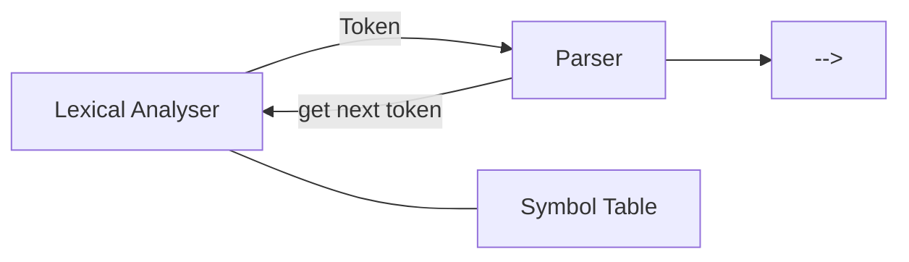
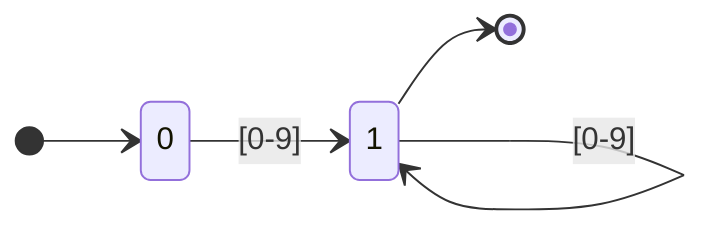
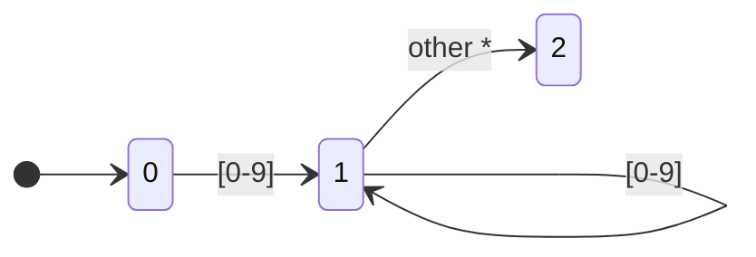
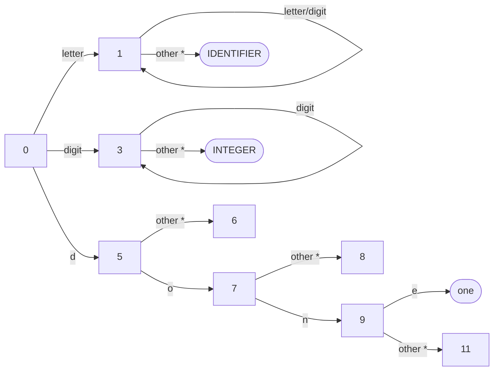
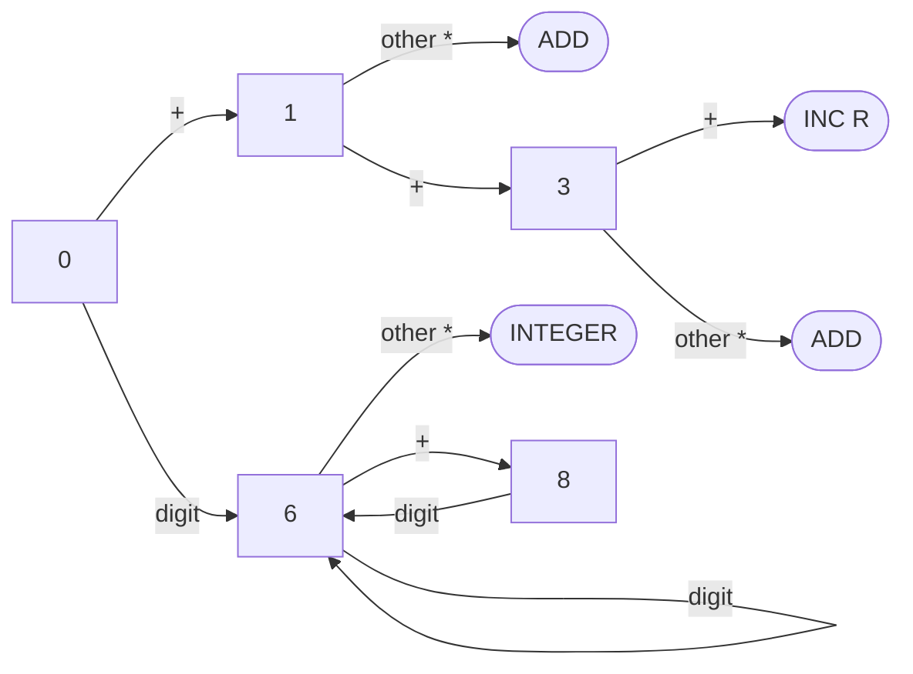

# Compiler Construction

**Institution:** Rivers State University, Nkpolu-Oroworukwo, Port Harcourt
**Lecturer:** Dr. E.O Bennett and Dr. E.E Omaegbu
**Course Code:** CMS 709
**Course Title:** Compiler Construction
**Session:** 2024/2025
**Topic:** Lexical Analysis
**Date:** 15/02/16

---

## Lexical Analysis

This is the first phase of a compiler.

**Lexical Analysis:** The process of taking an input string of characters (such as source code of a computer program) and producing a sequence of symbols called "lexical tokens" or just "tokens".

The lexical analyzer reads the source text and thus, it may perform certain secondary tasks:

- **(i)** Eliminate comments and delete spaces in the form of blanks, tabs and newline characters.
- **(ii)** Correlate error messages from the compiler with the source program (e.g. keep track of no. of lines).

The interaction with the parser is usually done by making the lexical analyzer be a sub-routine of the parser.



> **Fig (a):** Interaction of Lexical Analyser with the Parser

---

## Why Separate LA from Syntax Analysis?

- **(i)** Simplification of design — software engineering reasons.
- **(ii)** I/O issues are limited in LA alone.
- **(iii)** More compact and faster parser — slimming the grammar (by eliminating comments, blanks, etc.) makes the parser faster.
- **(iv)** LA based on Finite Automata are more efficient to implement than "pushdown" automata used for parsing (due to stack).

---

## Tokens, Patterns and Lexemes

### Token

Also called "word". Is:

- **(i)** A string of characters which logically belong together — float, identifier, equal, minus, operators, constants, etc.
- Tokens are treated as terminal symbols of grammars specifying the source language.

### Pattern

The set of strings for which the "same" token is produced. Or:

A rule that describes the set of strings associated to a token. Expressed as a "regular expression" and describing how a particular token can be formed. e.g.:

```
[A-Za-z]  [A-Za-z_0-9]*
```

The pattern "matches" each string in the set. e.g.: `float`, `(l+d+)`, `=`, `-`, `d+`, `;`

### Lexeme

The sequence (actual) of characters forming a specific instance of a token. e.g.: `"num"` or `"float"`, `"abs_zero_kelvin"`, `"e_yn_m"`, `273`, `"."`, etc.

---

## Example — Tokens, Lexemes and Patterns

| Token    | Sample Lexeme              | Description of Pattern (informal)            |
|----------|----------------------------|-----------------------------------------------|
| const    | const                      | const                                         |
| if       | if                         | if                                            |
| relation | `<, <=, =, >=, >, !=`      | `< | <= | = | > | >= | !=`                    |
| id       | pi, count, D, a            | letter · (letter \| digit)*                  |
| num      | 3.1426, 0, 6, 6.22         | any numeric constant                          |
| literal  | "core dumped"              | any x b/w `"` and `"` except `"`             |

> **Note:** In Pascal statement `const pi = 3.1426`, the substring "pi" is a lexeme for the token "identifier".

> **Note:** When more than one pattern matches a lexeme, the lexical analyzer must provide additional info about the particular lexeme. e.g.: Pattern "num" matches `'0'` and `'1'`. It is essential for code generation to know which string was actually matched. The lexical analyzer collects info about tokens into their associated attributes.

---

## Tokens in Practice (Attributes)

In practice, a token has only a single attribute — a pointer to the symbol table entry in which the info about the token is kept such as:

- The lexeme, the line no. on which it was first seen, etc.

**e.g. FORTRAN Statement:**

```
E = M * C ** 2
```

Tokens and associated attributes:

- `<id, pointer to Symbol table for E>`
- `<assignOp>`
- `<id, pointer to Symbol-table for M>`
- `<multiOp>`
- `<id, pointer to Symbol-table for C>`
- `<multiOp> ---`

---

## Tokens in Programming Languages

- Keywords, operators, identifiers (names), constants, literal strings, punctuation symbols such as parentheses, brackets, commas, semicolons, and colons, etc.
- A unique integer representing the token is passed by LA to the parser.
- Attributes for tokens (apart from the integer representing the token):
  - **identifier:** the lexeme of the token, or a pointer into the symbol table where the lexeme is stored by the LA
  - **intnum:** the value of the integer (similar for floatnum, etc.)
  - **string:** the string itself
- The exact set of attributes are dependent on the compiler design.

---

## Difficulties in LA

- Certain languages do not have any reserved words. e.g.: while, do, if, else, etc. in C/C++, but not in PL/1.
- In FORTRAN, some keywords are context-dependent. e.g.:
  - `DO100I = 100,2` — `DO100I` is an identifier, and `DO` is not a keyword; but
  - `DO 100 = 10,2` — `DO` is a keyword.
  - Such features require substantial lookahead for resolution.
- In FORTRAN, blanks are not significant and can appear in the midst of identifiers, but not in C/C++.

---

## Errors in LA

LA cannot catch any significant errors, except for simple errors such as illegal symbols, etc. In such cases, LA skips xtrs in the input until a well-formed token is found.

- LA has a very localized view of the source text.
- It cannot tell whether a string "fi" is a misspelling of a keyword "if" or an identifier.
- The LA can detect characters that are not in the alphabet or strings that have no pattern.
- In general, when an error is found, the lexical analyzer stops (but other actions are also possible).

---

## Specification and Recognition of Tokens

### (i) Regular Definitions

A mechanism based on "regular expressions" and very popular for specification of tokens. It has been implemented in the lexical analyzer generator tool, LEX. We study regular expressions first, and then token specification using LEX.

### (ii) Transition Diagrams

Transition Diagrams (TD) are usually used to model LA by translating them to programs by hand.

---

## Type 0 — Type 3 Languages

Type 0 — Type 3 languages are finite representations of respective languages.

### Examples of Languages

Let **Σ = {a, b, c}**

- **(i)** L1 = {aᵐbⁿ | m, n > 0} is **regular**
- **(ii)** L2 = {aⁿbⁿ | n > 0} is **context free** but not regular
- **(iii)** L3 = {aⁿbⁿcⁿ | n ≥ 0} is **context sensitive** but neither regular nor context free
- **(iv)** Showing a lang that is Type-0, but none of CSL, CFL, or RL is very intricate, therefore omitted.

---

## Language Representations

- **(i)** If Σ is an alphabet, Σ\* is a set of all strings over Σ. Each subset of Σ\* is a **language** (a lang. is a set of strings of symbols from some alphabet).
- **(ii)** Transition Diagrams (TD), a variant of Finite State Automata (FSA), are used to implement regular definitions and to recognize tokens.
  - TDs are usually used to model LA by translating them to programs by hand.
- **(iii)** Each language must have a finite representation:
  - A finite representation can be encoded by a finite string.
  - Thus, each string of Σ\* can be thought of as representing some language over the alphabet Σ.
  - Σ\* is countably finite.
  - Hence, there are more langs. than representations.

---

## Input Buffering — General Idea

- We use a buffer divided into 2-N character halves.
- We read N input xtrs into each half of the buffer with one system command rather than invoking a read command for each input xter.
- If fewer than N xtrs remain in the input, then a special xter "eof" is read.
- Two pointers to the input buffer is maintained.
- The string of xtrs b/w the two pointers is the current lexeme.
- Initially both pointers point to the first xter of the lexeme to be found.

> Some tokens such as parentheses do not really have values, and so the evaluator function for these can return nothing. The evaluator for integers, identifiers, and strings can be considerably more complex. Sometimes evaluators can suppress a lexeme entirely, concealing it from the parser, which is useful for white space and comments.

---

## Stages of Lexical Analyzer

### (a) Scanner

This is based on a finite state machine. If it lands on an accepting state, it takes note of the type and position of the acceptance, and continues. Sometimes it lands on a "dead state", which is a non-accepting state. When the LA lands on a dead state, it is **done**. The last accepting state is the one that represents the type and length of the longest valid lexeme. The "extra" non-valid character should be "returned" to the input buffer.

### (b) Evaluator

This goes over the characters of the lexeme to produce a value. The lexeme's type combined with its value is what properly constitutes a "token", which can be given to a parser.

---

## Differences b/w TD and FSA

- **(i)** FSA accepts or rejects a string. TD reads xtrs until finding a token, returns the read token and prepares the input buffer for the next.
- **(ii)** In a TD, there is no out-transition from accepting states (for some authors).
- **(iii)** Transitions labelled "other" (or not labelled) should be taken on any character except those labelling transitions out of a given state.
- **(iv)** States can be marked with a `*`: this indicates states on which a "retraction" must take place.

To consider different kinds of lexeme, we usually build separate DFAs (or TDs) corresponding to the regular expressions for each kind of lexeme, then merge them into a single combined DFA (or TD).

---

## Input Buffer Pointers

- One called the **"forward pointer"** scans ahead until a match for a pattern is found.
- Once the next lexeme is determined, the forward pointer is set to the first character of it.
- After the lexeme is processed, both pointers are set to the character immediately past the lexeme.
- With this schema, comments and white spaces can be treated as patterns that yield no token.

---

## Lexical Analyzer Specification

To specify a lexical analyzer we need a "state machine", sometimes called Transition Diagram (TD), which is similar to FSA (Finite State Automata).

TDs depict the actions that take place when the lexer is called by the parser to get the next token.

---

## Example — FSA vs TD Diagrams

### Fig (a) — FSA for digits



### Fig (b) — TD for digits with retraction



> State 2 is the accepting state; `*` on transition from state 1 to 2 means retraction (input pointer must be retracted).

---

## Recognizing Keywords

Keywords have the same pattern as identifiers but do not correspond to the token "identifier".

Two solutions are possible:

### (A) Keywords as Identifiers

This technique for separating identifiers from keywords consists in initializing appropriately the symbol in which information about identifiers is saved. For instance, we enter the strings "if", "then" and "else" into the symbol table before any characters in the input stream are seen.

- When a string is recognized by the TD:
  - **(a)** The symbol table is examined
  - **(b)** If the lexeme is found there, it is marked as Keyword:
    - Then the string is a Keyword
    - Otherwise the string is an Identifier

**Example Symbol Table:**

| Entry | Type       |
|-------|------------|
| do    | Keyword    |
| end   | Keyword    |
| for   | Keyword    |
| while | Keyword    |
| ...   | ...        |
| cont  | Identifier |

### (B) Regular Expressions for All Keywords

- Keywords can be prefixes of identifiers (ex: `do` and `done`).
- The lexer that results from this technique is much more complex but they are necessary when we use lexical analyzer generators from some specification.
- The specification is made by regular expressions.

---

## TD Example 1 — Combined TD for Identifiers, Keywords and Numbers



---

## TD Example 2 — Unsigned/Signed Integers, Addition (+) and Increment (++)



---

## Transition Table — TD Example 2

| State | + | − | D     | Token   | Retraction |
|-------|---|---|-------|---------|------------|
| 0     | 1 | 8 | 6     | —       | —          |
| 1     | 3 | 2 | 2     | —       | —          |
| 2     | — | — | —     | ADD     | 1          |
| 3     | 5 | 4 | 4     | —       | —          |
| 4     | — | — | —     | ADD     | 2          |
| 5     | — | — | —     | INCR    | 2 (or 0)   |
| 6     | 7 | 6 | 6     | —       | —          |
| 7     | — | — | —     | INTEGER | 1          |
| 8     | error | error | — | —   | —          |

---

## Implementation of Lexical Analyzer

Different ways of creating a lexical analyzer:

### (i) Automatic Generator (e.g. LEX or FLEX)
- **(a) Advantages:** Easier and faster development.
- **(b) Disadvantages:** LA is not very efficient and difficult maintenance.

### (ii) Write LA by Hand Using HLL
- **(a) Advantages:** More efficient and compact.
- **(b) Disadvantages:** Done by hand.

### (iii) Write LA Using Low-Level Language
- **(a) Advantage:** Very efficient and compact.
- **(b) Disadvantage:** Development is complicated.

#### Automatic Tool Input Specification:
- **(a)** Regular expressions representing the patterns
- **(b)** Actions to take according to the detected tokens

- **(iv)** Each regular expression is associated with a phrase in a programming language which will evaluate the lexemes that match the regular expression.
- **(v)** The tool then constructs a state table for the appropriate finite state machine and creates program code which contains a table, the evaluation phrases, and a routine which uses them appropriately.

---

## Priority of Tokens

### (A) Longest Lexeme
- `DO` and `DOT` → (DOT is taken)
- `>` and `>=` → (`>=` is taken)

### (B) First-listed Matching Pattern

The following regular expressions appear in lexical specification:
- `w.h.i.l.e` : Keyword `'while'`
- `letter.(letter|digit)*` : identifier

- **(a)** In the input we read `while`
- **(b)** The lexer considers it as Keyword
- **(c)** If we change the order of specification, then we will never detect a keyword "while" (it would be recognized as an identifier instead).
