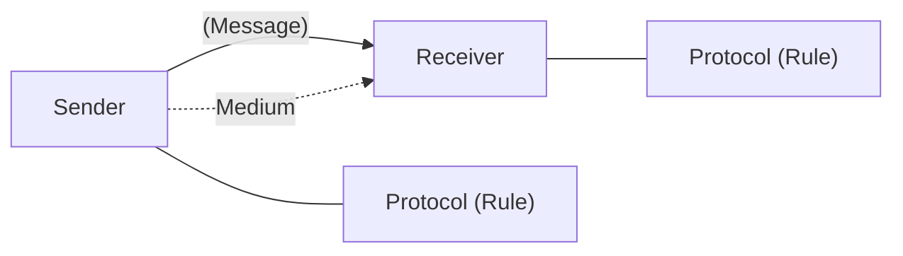
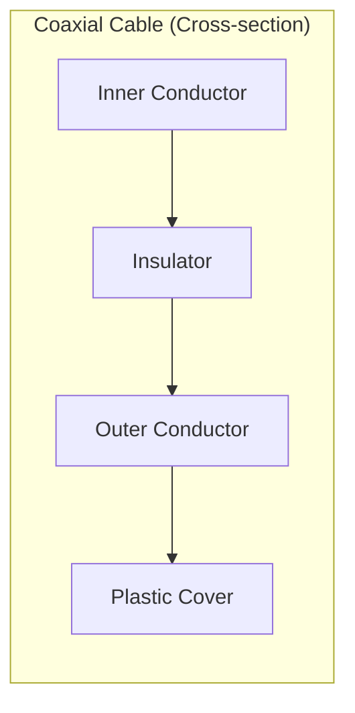
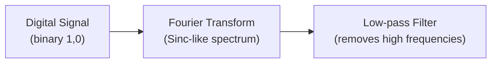

# Data Communication and Networks - CMS 703

**Institution:** Rivers State University, Nkpolu-Oroworukwo, Port Harcourt
**Lecturer:** Dr. Saturday
**Course Code:** CMS 703
**Course Title:** Data Communication and Networks
**Session:** 2024/2025

---

## Data Communication

It is the sharing of information locally or remotely.

A **Data Communication System** has five components that make up the data communication system:

1. **Message** — refers to the data (information) to be transmitted (e.g. pictures, text, audio, numbers, etc.)
2. **Sender** — originating device from which the data is sent (e.g. mobile phone, computer, camera, etc.)
3. **Receiver** — the destination device that will receive the message (e.g. mobile phone, television, etc.)
4. **Transmission Medium** — the physical path where the message travels (or passes) from the sender point to the receiving point (e.g. twisted pair wire, coaxial cable, fibre-optic cable, radio waves, etc.)
5. **Protocol** — a set of rules that guide data communication. It enables synchronization between the sender and receiver.



---

## Representation of Data

The data that is communicated can be in different forms and has its representation that will enable comprehension by the end devices.

### Text

Represented by bit patterns — a collection of binary bits (0s or 1s).

There are different sets of bit patterns (codes) used to represent text symbols and each set is called a **code**. The mostly used code is called **Unicode**. It uses 32 bits for a symbol or character in any language globally. The ASCII code makes up 127 characters on the Unicode and is referred to as Basic Latin.

**Numbers:** Bit patterns also used to represent numbers but does not use the ASCII code. The number is converted directly to binary. The number includes bits that help in mathematical operations.

### Images

Also represented by bit patterns. Composed of a matrix of pixels (picture elements). The size of the pixel depends on the **resolution**. An image divided into pixels — each pixel is assigned a bit pattern and the value and size depend on the image. For example:
- Black pixel assigned to `00`
- Dark grey pixel assigned to `01`
- Light grey pixel assigned to `10`
- White pixel assigned to `11`

**RGB** and **YCM** are methods used to represent colour images.

### Audio

Has a continuous signal and not discrete. Can be changed to digital. Represented as a smooth function of time.

### Video

Can be a continuous entity or a combination of images. Can be changed to digital or analog (voltage, current, electromagnetic wave). To transmit a continuous signal digitally, it must first be **sampled** or **quantized** — the signal is measured at regular intervals. To quantize it, each sample is approximated with a finite set of values, and the values are represented as bit patterns which is called **Encoding**.

---

## Data Flow

Refers to the style in which data is transmitted from one point to another. There are **3 forms**:

### Simplex

Communication is unidirectional. Only one end can transmit or send data.
- Examples: Keyboard and Monitor, TV and Remote, TV broadcast.

### Half-Duplex

Communication from both ends but not at the same time.
- Examples: Walkie-talkie, Web browser, WiFi.

### Full Duplex

Communication in both directions simultaneously or at the same time.
- Example: Telephone network, live chat. The capacity of the channel is shared.

---

## Transmission Media

Refers to a free space, metallic cable or optical cable used to transport the message or information from source to destination. Subdivided into **2 categories**: **Guided** and **Unguided**.

- **Guided:** Twisted Pair, Coaxial cable, and Fibre-Optic cable
- **Unguided (Wireless):** Free space

### Twisted-Pair Cable

Consists of two conductors (copper) each insulated with plastic and twisted together. The number of twists per unit length affects the quality of the cable. Used in telephone but to provide voice and data channels. Also used in 10Base-T and 100Base-T Local Area Networks.

### Coaxial Cable

Has a central core conductor of solid or stranded copper wire enclosed in an insulated sheath and covered with an outer semi-metal foil conductor. This serves as a shield against noise and as a conductor to complete the circuit. Covered with a plastic cover as an insulator. Used in analog telephone networks and later in digital telephone networks. Replaced by fibre-optic cable. Cable TV also uses it. Applications: satellite installation, CCTV.



### Fibre-Optic Cable

Transmits signal in the form of light. Made of glass or plastic. Uses reflection to guide light through a channel. The difference in density of the two materials must be such that a beam of light moving through the core is reflected off the cladding.


**Cable composition layers:** Outer Jacket (PVC or Teflon) → Inside Jacket (Kevlar) → Cladding → Core

Usually found in backbone networks. Has wide bandwidth and is cost-effective. Cable TV uses fibre-optic and coaxial to create a hybrid network. Local area networks like 100Base-FX (Fast Ethernet) and 1000Base-X also use fibre-optic cable.

#### Advantages of Fibre-Optic Cable

1. High bandwidth
2. Less signal attenuation — 8km for 50km vs coaxial or twisted pairs that need repeaters every 5km
3. Immunity to electromagnetic interference (EM noise cannot affect it)
4. Resistance to corrosive materials (glass)
5. Light weight — much lighter
6. Higher immunity to tapping (copper cables create antenna effects that can be tapped)

#### Disadvantages of Fibre-Optic Cable

1. Installation and maintenance require expertise
2. Expensive to install
3. Fragile — can be broken if bent too sharply or under excessive pressure

---

## Unguided Media (Wireless Communication)

Signal travels from source to destination in 3 ways:
- **Ground Propagation**
- **Sky Propagation** (Radio Waves)
- **Line-of-Sight Propagation**

### Radio Waves

Characterized by frequencies ranging between **3 KHz and 1 GHz**. Can be **omnidirectional** — sending and receiving antennas don't have to be aligned. Radio waves propagated in sky mode travel long distances, appropriate for broadcasting (AM radio). The radio wave band is relatively small (less than 1 GHz) compared to microwaves. Used for multicasting — one sender and many receivers.

- **Examples:** AM and FM radio, TV, Maritime radio, cordless microphones, paging.

### Microwaves

Electromagnetic waves with frequencies ranging between **1 and 300 GHz**. Microwave transmission emanates from an antenna and is focused since they are **unidirectional**. Sending and receiving antennas need to be aligned. Signals use unidirectional antennas based on the geometry of a parabola (e.g. parabolic dish, horn antenna).

#### Characteristics of Microwave Signals

1. **Line-of-sight propagation** — positioned towers or mounted antennas to avoid curvature of the earth. For very distant communication, repeaters are required.
2. Very high frequency microwaves cannot pass through walls.
3. Relatively wide band of about 299 GHz. Wider sub-bands can be allocated to achieve a high data rate.
4. Some part of the band restricted, requires permission of regulatory authorities.

### Infrared

Waves with frequencies between **300 GHz to 400 THz**, wavelength range from 1mm to 770nm. High frequencies cannot penetrate walls, preventing interference between systems. Used for **short-distance communications**.

- **Applications:** Remote control, night vision devices (convert ambient photons of light into electrons), Fourier analysis using chemical process, Infrared Astronomy (for observing objects in the universe impossible to detect with light), infrared tracking/missile guidance systems, gas detectors, laser analysis, thermal-imaging cameras (to detect overheating of electronic components).

---

## Fourier Analysis

A concept that analyses a function of time to generate a function of frequencies, revealing components that are not obvious in the original signal. Can be termed a mathematical method that **decomposes complex signals or functions to simple sine and cosine waves**, converting data from the **time domain** to the **frequency domain**.

### Applications of Fourier Analysis

1. **Engineering and Signal Processing** — to filter noise, data analysis, compress signals
2. **Physics** — important for acoustics, optics and quantum mechanics
3. **Neuroscience** — for analysing time series data to find hidden rhythms in neural recordings
4. **Mathematics** — for reducing complex differential equations to simpler algebraic ones

---

## Fourier Series

An aspect of Fourier analysis. A method for representing **periodic signals**. Periodic signals are signals that repeat over and over (e.g. sine, square wave). Splits a periodic signal into a sum of sines and cosines with different amplitudes and frequencies.

Represented mathematically as:

```math
f(x) = \frac{a_0}{2} + \sum_{n=1}^{\infty} \left[ a_n \cos\!\left(\frac{n\pi x}{L}\right) + b_n \sin\!\left(\frac{n\pi x}{L}\right) \right]
```

Where:
- `f(x)` is the periodic function
- `L` is the period (L can be T)
- `a₀` is the average value = `(1/2L) ∫ f(x) dx`
- `aₙ` is the **Cosine Coefficient** = `(1/L) ∫ f(x) cos(nπx/L) dx`, n > 0
- `bₙ` is the **Sine Coefficient** = `(1/L) ∫ f(x) sin(nπx/L) dx`, n > 0

> **NOTE:**
> - When f(x) is **even**: bₙ = 0 → **Fourier Cosine Series**
> - When f(x) is **odd**: aₙ = 0 → **Fourier Sine Series**

### Period, Frequency, and Amplitude

- The **period** is the distance on the x-axis after which the shape repeats = 2π.
  - For sin(2x): period = π
  - For sin(3x): period = 2π/3
  - For sin(nx): period = 2π/n
  - *The larger the number in front of x, the shorter the period.*

- The **frequency** is the opposite of period: `f = 1/T`
  - sinx → the **fundamental frequency**
  - sin(3x) → the **harmonics** (exact multiple of the fundamental frequency)

- The **amplitude** is how high or low the wave is — controls the size of the wave.
  - E.g. y = A sin(θ). If A = 1, the wave moves amplitude from +1 to −1.

Given `f(x) = (4/π)[sin(x)/1 + sin(3x)/3 + sin(5x)/5 + sin(7x)/7 + ...]` this approximates a square wave.

### Fourier Series of a Square Wave — Worked Example

Given:

```
f(x) = { A   for 0 < x < π
        {-A   for π < x < 2π
```

**Finding a₀:**

```math
a_0 = \frac{1}{2\pi}\int_0^{2\pi} f(x)\,dx = \frac{1}{2\pi}\left[\int_0^\pi A\,dx + \int_\pi^{2\pi}(-A)\,dx\right] = \frac{1}{2\pi}[A\pi - A\pi] = 0
```

*(a₀ is the DC component of the wave)*

**Finding aₙ:**

```math
a_n = \frac{1}{\pi}\int_0^{2\pi} f(x)\cos(nx)\,dx = \frac{A}{\pi}\left[\int_0^\pi\cos(nx)\,dx - \int_\pi^{2\pi}\cos(nx)\,dx\right]
```

Since sin of any integer multiplied by π = 0, and sin(0) = 0, everything cancels out:

> **aₙ = 0 for every integer n**

**Finding bₙ:**

```math
b_n = \frac{1}{\pi}\int_0^{2\pi} f(x)\sin(nx)\,dx = \frac{A}{\pi}\left[\int_0^\pi\sin(nx)\,dx - \int_\pi^{2\pi}\sin(nx)\,dx\right]
```

After integration and substituting boundary values using cos(0) = 1, cos(2π) = 1, cos(nπ) = (−1)ⁿ:

```math
b_n = \frac{A}{n\pi}\left[2(1 - (-1)^n)\right]
```

- When **n is even** (n = 2, 4, 6, ...): (−1)ⁿ = 1, so **bₙ = 0**
- When **n is odd** (n = 1, 3, 5, ...): (−1)ⁿ = −1, so **bₙ = 4A/nπ**

> **It implies that only the odd harmonics exist and the even harmonics cancel out.**

---

## Fourier Transform

Refers to the relationship between the **time domain** of a single signal and its **frequency domain**. Decomposes a signal into oscillatory functions. The original signal can be obtained from its transformation; hence, no information is created or lost during the process.

| Symbol | Meaning |
|---|---|
| f(t) | Original signal (time domain) |
| F(ω) | Transform signal (frequency domain) |
| ω | Angular frequency |
| i | Imaginary unit |

**Forward Transform:**

```math
F(\omega) = \int_{-\infty}^{\infty} f(t)\,e^{-i\omega t}\,dt
```

Note: `e^{-iωt} = cos(ωt) − i·sin(ωt)`

**Inverse Transform (to recover original signal):**

```math
f(t) = \frac{1}{2\pi}\int_{-\infty}^{\infty} F(\omega)\,e^{i\omega t}\,d\omega
```

### Examples of Fourier Transform

| Signal | Fourier Transform |
|---|---|
| Rectangular Pulse | Sinc function in frequency domain |
| Gaussian Function | Remains Gaussian |
| Sinusoidal wave | Delta function at its frequency |

### Applications of Fourier Transform

1. **Signal Processing** — Compression, Filtering, Modulation
2. **Image Processing** — Edge detection, Blurring, Sharpening
3. **Physics** — Solving wave and heat equations
4. **Engineering** — Analyze vibrations, circuits and control systems

### Fourier Transform of a Square Pulse

Given a square pulse signal with period range of −T/2 to T/2, the Fourier Transform will be:

```math
F(\omega) = T\cdot\text{sinc}\!\left(\frac{\omega T}{2}\right)
```

This means the square pulse contains many frequencies. The Sinc function shows how these frequencies are distributed: strongest at the centre and fading outward.

> **The wider the pulse in time, the narrower the frequency spread; the narrower the pulse in time, the wider the frequency spread.**

### Worked Example: Fourier Transform

**Find the Fourier Transform of f(t) = e^{−at}u(t), a > 0** where u(t) is the unit step function: u(t) = 1 for t ≥ 0 and u(t) = 0 for t < 0.

**Solution:**

```math
F(\omega) = \int_{-\infty}^{\infty} f(t)\,e^{-i\omega t}\,dt = \int_0^{\infty} e^{-at}\,e^{-i\omega t}\,dt = \int_0^{\infty} e^{-(a+i\omega)t}\,dt
```

Using the standard exponential integral `∫₀^∞ e^{-bt} dt = 1/b` for Re(b) > 0, where b = a + iω and a > 0:

```math
\boxed{F(\omega) = \frac{1}{a + i\omega},\quad a > 0}
```

---

## Real Life Scenario: Bandwidth Allocation in Communication

Designing a system that will transmit digital data over a physical medium (e.g. copper wire, fibre optic or wireless radio). Data is modeled as a time-domain signal (voltage or light intensity over time).

**Key questions to answer:** What frequencies are present? How much bandwidth does the signal occupy? Will it interfere with other signals?

**Solution approach:**

1. **Model the signal** (e.g. square pulses)
2. **Apply Fourier Transform** — transforms into Sinc function
3. **Analyze the spectrum:**
   - Identify the dominant frequencies
   - Determine the bandwidth needed to transmit without distortion
   - Design filters to remove noise or prevent interference with close channels



> Engineers can use this to allocate frequency bands in WiFi, 4G, and 5G. This principle powers **OFDM (Orthogonal Frequency Division Multiplexing)** — a core technology in 5G and LTE (Long Term Evolution).

---

## Serial and Parallel Data Transmission

Two basic methods: **Serial** and **Parallel** data transmission. Central for network design, computer architecture and communication systems.

### Serial Data Transmission

Method where data is transmitted **one bit after another** over a single communication channel. Characterized by one channel/wire for data transfer. Sequential travel of bits. Commonly used in long distance communication.

#### Advantages of Serial Transmission

1. Cost effective — requires fewer cables or wire
2. Reliable over long distances (less signal distortion and data corruption)
3. Widely used in modern networks (e.g. USB, Ethernet, serial ports RS-232)

#### Disadvantages of Serial Transmission

1. Slower than parallel transmission for short distances
2. Requires synchronization between sender and receiver
3. Not ideal for bulk transfers
4. Hardware constraint can cap performance (max speed depends on how fast bits can be sent per second)
5. Prone to synchronization challenges (sender and receiver must be in sync)

### Parallel Data Transmission

Method where **multiple bits are transmitted simultaneously** across multiple channels/wires/cables. Characterized by use of multiple wires (one per bit). Transfers an entire word (byte) at once. Common in short distance, high-speed communication.

#### Advantages of Parallel Data Transmission

1. High speed transfer (multiple bits transferred at same time)
2. Efficient for short distances (within a computer)

#### Disadvantages of Parallel Data Transmission

1. Expensive — requires more wires and connectors
2. Signal might be skewed (bits arriving at different times)
3. Not suitable for long distances due to interference and synchronization issues (e.g. computer buses, data bus in CPU, printer connections, internal memory transfer)

### Examples of Long-Distance Communication

| Technology | Transmission Type |
|---|---|
| Telephone Network (Digital Telephony) | Serial — voice sent bit by bit over T1, E1 lines |
| Fibre Optic Communication | Serial — light pulses in a single stream (Internet backbone, undersea cables) |
| Satellite Communication | Serial — bit streams before modulation and transmission |
| Wireless (WiFi, 4G/5G) | Serial — data packets transmitted one bit after another over radio waves |

### Serial Communication Applications in Embedded Systems

- **RS-232, RS-485, SPI** used in long distance control and monitoring (SCADA)
- Systems used in power plants, oil refineries, water treatments
- Oil and gas pipelines use RS-485 or Modbus to transmit pressure/flow data across kilometres
- Smart grid/power distribution: electrical sub-stations use **DNP3** over RS-232/RS-485
- Network monitoring tools (e.g. PRTG/Zabbix)

---

## Asynchronous and Synchronous Transmission

Two fundamental modes of data transfer related to timing and synchronization of devices.

### Asynchronous Transmission

Characterized by **character-by-character** framing with Start and Stop bits. No shared clock; synchronization happens at the character level.

**Frame structure:**

```
| Start bit | D0 | D1 | D2 | D3 | D4 | D5 | D6 | D7 | [Parity] | Stop bit |
```

- **Start bit** — signals beginning of the character
- **Data bits** — 7 or 8 bits (actual information)
- **Parity bit** — optional, for error detection
- **Stop bit** — signals end of the character

#### Advantages of Asynchronous Transmission

1. Simple and cost effective
2. Efficient for sporadic or irregular data
3. Easy to implement

#### Disadvantages of Asynchronous Transmission

1. Extra bits reduce efficiency
2. Slower for continuous, large data transfer
3. Has less precise timing

#### Applications

Serial ports (RS-232), keyboard/mouse communication, early dial-up modems.

> **Real-life example:** Sending short text messages.

### Synchronous Transmission

Data transfer in form of **blocks (or frames)** without start or stop bits. Sender and receiver synchronized by a clock or special signals.

**Frame structure:**

```
← [Sync | Sync | Data | Data | Data | Data | Data | Data]   (data flow direction)
```

Structure: continuous stream of data. Synchronization achieved through preambles, clock signals, or special characters. Error detection handled with **checksum** or **CRC**.

#### Advantages of Synchronous Transmission

1. High efficiency (no start and stop overhead)
2. Faster transmission rate
3. Suitable for bulk, continuous data transfer

#### Disadvantages of Synchronous Transmission

1. More complex and costly
2. Requires precise synchronization
3. If there are errors, can affect large blocks of data

#### Applications

Ethernet networks, broadband communication, digital telephony and satellite/wireless systems.

> **Real-life examples:** Phone calls, video calls.

---

## Computer Network

*(Notes dated: 24/1/2026)*

A **computer network** is a collection of interconnected devices (computers, servers, switches, etc.) that communicate and share resources. Computer networks range from small local setups to global infrastructures.

### Types of Computer Networks

#### Based on Scope

| Type | Full Name | Coverage |
|---|---|---|
| **LAN** | Local Area Network | Small area (e.g. office, home) |
| **MAN** | Metropolitan Area Network | A city or large campus (e.g. bus/metro area) |
| **WAN** | Wide Area Network | Large geographical area (e.g. Internet) |

#### Based on Topology

1. **Bus Topology**
2. **Star Topology**
3. **Ring Topology**
4. **Mesh Topology**
