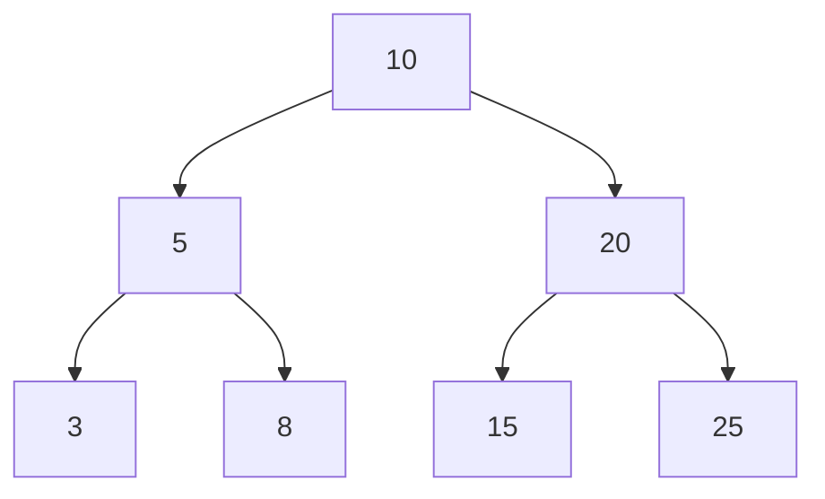
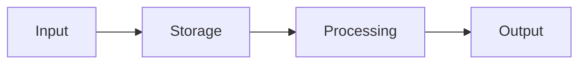

# Programming Languages

**Institution:** Rivers State University, Nkpolu-Oroworukwo, Port Harcourt
**Lecturer:** Dr. H. Okwu
**Course Code:** CMS 705
**Course Title:** Programming Languages
**Session:** 2024/2025

---

## What is a Language?

A **language** is the principal method of human communication, conveyed in structured and conventional word and thought — by speech, writing, or gesture. It is also a system of communication used by a particular country or community.

In computing, it is a formal system of instructions used to communicate with a computer and also used to describe a system by formulae and rules for writing programs or algorithms (beyond taxonomy).

> **The meaning of a word can/does change in different contexts.**
>
> E.g. *"animal"* and *"cat"* change meaning in context — in word class: Noun (Verb), we've related (Verb).

It is important because it helps in correct pronunciation and distinguishes meaning in spoken English.

---

## Language Structure

It is the systematic arrangement and organisation of language sounds and sentences to enable clear and concrete communication. It is often described as a "system of systems" where individual building blocks combine to create increasingly complex units according to specific rules — e.g. English.

**Core Components of Language Structure:**

### 1. Phonology
It is the study of sound patterns — it studies the smallest unit of sound called a **phoneme** (the basic "sound" of a language, such as keywords, operators, identifiers, and numeric constants — various nodes).

E.g. `int age;` — `cout << "Enter age: ";` — `cin >> age;` — `cout << age;`

### 2. Morphology
It studies how words are derived and constructs; it deals with the smallest unit by meaning, which include root words and prefixes or suffixes.

E.g. `whitespace = a + b + happy + ness` — `Walked = Walk + ed`

It is important because it explains rules, plurality, comparison, and derivation; it also helps to expand vocabulary.

### 3. Syntax
It is the study of how words are arranged to form sentences; it is a set of rules governing how words and phrases are arranged to create well-formed, legal sentences. It determines the order of words (e.g. Subject–Verb–Object) and how they relate to one another.

E.g. *"She is reading"* — *"Your music is under a book"*

It is important because it ensures **grammatical correctness** and distinguishes questions, statements, and commands.

### 4. Semantics (Meaning of words)
- **Lexical Semantics** (meaning of words): homonyms (similar meaning), polysemy (many meanings)
  - E.g. *"the room is big and the moon is large"* (alt. — different objects)
- **Compositional/Sentence Semantics** (meaning of sentences): *"the sky but the moon, and the sun but the sky"*

It is important because it prevents misunderstanding and enables clearer verbal meaning.

### 5. Pragmatics
It is the study of language in social contexts; it focuses on how context, speaker intention, and cultural norms influence the interpretation of meaning beyond the literal words used.

E.g. *"Can you open the window?"* — this is a request, not a question about ability.

It is important because it enables polite and appropriate communication and also explains implied meanings.

---

## Language Definition Semantics

In computer science, a language is a **formal system** of symbols and rules used to transmit information and instructions between a sender (human or program) and a receiver (computer or hardware). It is also a formal system designed to communicate information to a computer. Every instruction must have **precise, single meaning** in computer language.

**Language Definition Semantics** refers to the precise framework of rules used to specify a formal language such as a programming language to ensure a computer can process it without ambiguity — i.e., to avoid ambiguity, every programming language must be **precisely defined**.

A language definition answers three key questions:
1. What programs look like (**Syntax**)
2. What programs mean (**Semantics**)
3. How programs are used in practice (**Pragmatics**)

**Components or Layers of Language Definition Semantics:**

Computer language definition structure follows the same structure as linguistics but focuses on three primary components:

---

## Phonology (General) — Components in Programming

**Phonology (General)** — component details that describe the highest level representations of the structure; the creator uses our **programs and procedures** in programming.

E.g. `my_age = 20;` — `Take_off (me, pg, + 3);`

### Morphology (Individual/Distinctive Parts)
In English, it is how tokens are formed; in C++ how keywords, operations and identifiers are "building blocks" of the language and build meaningful units.

E.g. `int c = 0;` — `variable = identifier (Enum, 15);` — *`=` is a keyword of programming*

**Vocabulary & Identifier** — names given to various elements in a program (such as variables, functions, classes, and modules).

E.g. Country

### Syntax (Grammar Rules)
It is the rules for correctly ordering sentences in a language; it is intended to be used for a programming language. It involves readability (clarity of syntax), writability (ease of syntax), and reliability (ability of syntax to prevent errors).

E.g. In C++:
```cpp
for (int a = 0; a < 10; a++) {
  // loop body
}
```

### Static Semantics
It involves checking the rules directly during compilation to prevent execution errors or ensuring a variable is declared before use (type compatibility) and kinds of errors.

E.g.:
```cpp
x = "hello"; // Compile error because you cannot add
              // a string to an integer type in many languages
```

### Dynamic Semantics
It determines the action or behaviour of execution at runtime (evaluation, at runtime, of how expressions are evaluated, how values are computed, and how they change). It checks what actually happens when you execute an instruction or runtime.

E.g. In C++:
```cpp
int c = 0;
// If flag => 1 // overrides previous value
cout << c; // outputs: 1
```

### Pragmatics (Context and Usage)
It is intended to be used for a programming language; it involves readability (clarity of syntax), writability (ease and quality of syntax), reliability (error prevention), and efficiency (runtime performance). It interrogates how the language relates to the real world and the meaning of language. The practical usage compared with the formal usage of a language for specific tasks.

E.g. In C++:
```cpp
int age = ___;
cout << "Error age: ";
cin >> age;
cout << age;  // outputs correctly
```

---

## Types of Language (Levels of Abstraction)

Languages are categorised by how far they are removed from the physical hardware.

### 1. Lower-level Language (Machine Language)
It is the language the computer understands directly. In binary digits (0 and 1), it is executed by the CPU directly. No translation is needed and is very difficult for humans to understand. It is also very fast since it is executed by the CPU directly — it is **machine dependent**. It has a full control over registers, memory, and I/O; it is used internally by the computer.

### 2. Low-level Language (Assembly Language)
It is a step above machine language and uses mnemonic codes (like ADD, MOV, CMP); it is more readable than machine language. It is dependent on machine language — it requires an assembler to convert to machine code. It also has full control over registers, memory, and I/O — it is used in device drivers and embedded systems.

E.g. `MOV A, B` — `ADD A, 5`

### 3. Middle-level Language
It combines features of low-level and high-level languages; it can interact directly with hardware if needed. It supports structured programming — it is often used for systems programming and is both efficient and flexible; it is more readable than low-level machine language; it requires a compiler to translate to machine code. It is used in Operating Systems, compilers, and embedded systems; it is more complex than high-level languages; it can access hardware (memory addresses, pointers).

E.g. **C language**: `int Sum = a+b;`

### 4. High-level Language
It is designed to be easy for humans to read and understand (English-like); they are much more independent. They require compilers or interpreters. They are easy to use, end-user-focused. Examples are: Python, Java, C++, JavaScript.

**Differences between Middle-level and High-level language:**

| Feature | Middle-level lang | High-level lang |
|---|---|---|
| Portability | Moderate because it may require other platform specific adjustments | High because it is designed to be machine independent |
| Execution | Is faster because it produces higher/faster code directly | Is slower because some compilation takes longer |
| Memory Management | Is manual because programs are automatic because it uses |  |
| Portability | Moderate because it may require other-platform use | Complex (System, dynamic) Applications |
| Language | C, C++ | Python, Java, C++ |

---

## Core Structural Elements

Most modern computer languages (programming languages) share common sets of structural building blocks that they all have:

### a. Variables
A variable stores data about any kind of things — variables can store data about any change during execution. They hold data placed in the example above.

### b. Control Structures/Statements
These statements make the flow of execution in a program; control structures determine the order of which statements are executed in a program.

### c. Functions (Procedures)
They are blocks of code designed to perform specific tasks, enhancing modularity.

### d. Comments
They are non-executable text used to explain code to other human readers.

---

## Implementation Methods

For a computer to run high-level instructions they must be translated into machine code. They are:

- **a. Assembly** — a translates assembly language to machine code.
- **b. Compilation** — the entire program is translated at once into an executable file (e.g. `.exe`).
- **c. Interpretation** — the code is translated and executed line by line using an interpreter (e.g. Python, JavaScript).
- **d. Just-in-time (JIT)** — it compiles the entire source code (Java); it is compiled on demand which is an executable, generates some form of code. Java Virtual Machine (JVM) interprets the bytecode online — JIT is compatible to convert bytecode to machine code at runtime (e.g. Java).

---

## Data Types

A **data type** is a classification that tells the compiler what kind of data a variable can hold — how much memory to allocate and what operations are allowed on that data.

Data types are important because the precise type allows program reliability false (the compiler type-checking). Operations involve program reliability false the compiler type-checking. Operations direct, enable efficient use of memory while making operations more efficient.

In programming, data types are broadly categorised as **primitive** and **non-primitive** based on how they are defined in the language — they directly represent the data.

### Primitive Data Types (Basic Data Types)
They are the most basic building blocks of a programming language; they are provided by the language and represent single simple values directly understood by the CPU — they are usually stored directly in memory (a cache for very good cases). They are usually stored directly in binary form and cannot be null in many languages.

#### a. Integer (int)
These are used to store whole numbers. They are usually used for counting, loop control, and indexing arrays. There are four types of integer:

| Type | Size | Description |
|---|---|---|
| `int` | 4 bytes | Standard integer |
| `short int` | 2 bytes | Smaller integer |
| `long int` | 4 or 8 bytes | Large integers |
| `unsigned int` | 4 bytes | Non-negative integers (only positive values), used in SAE and other cases |

E.g. `int count = 10;` — the `+` and `-` Integer stores positive and negative whole numbers; it stores values (i.e. the standard int) from `-2,147,483,648` to `2,147,483,647`.

#### b. Float
It is used to store real numbers. There are three types, which are:

| Type | Size | Precision |
|---|---|---|
| `float` | 4 bytes | Single precision (7 decimal digits) |
| `double` | 8 bytes | Double precision (15–16 decimal digits) |
| `long double` | 8–16 bytes | Extended precision (18+ decimal digits) |

E.g. `float temperature = 36.5;` — `double pi = 3.14159265358;`

#### c. Character
It stores a single character; it is stored internally as ASCII or Unicode value; it is used to store single letters and symbol; it is used in text processing and it is 1 byte.

E.g. `char grade = 'A';` — enclosed in single quotes. Size: 1 byte.

#### d. Boolean
It stores logical values (`true` or `false`; it is used in decision making, conditional statements — the size is 1 byte.

E.g. `bool isLogged = true;`

#### e. Void (no value)
It is used for functions that return no value; it is used for functions with no return and can act as a generic pointer.

E.g.:
```cpp
void display() {
  cout << "Hello";
}
```

---

### Non-Primitive Data Types
They are also called reference or derived types because they are more complex. Structures build using other data types — they are compiler-defined and can store multiple values or occurrences. They are defined by the programmer or built from primitive types. They have a dynamic size that may grow or shrink.

#### 1. String
It is a sequence of characters used to represent text; it is enclosed in a double quote. String is a class with many functions like `length()`, etc. — it is a dynamic size.

E.g.:
```cpp
#include <iostream>
#include <String>  // if it is from the String library
using namespace std;
int main() {
  String name = "Alex Johnson";
  cout << name << endl;
  cout << "Length: " << name.length() << endl;
  return 0;
}
```

#### 2. Array
It stores multiple values of the same data type. It is used for storing lots of data.

E.g. `int numbers[] = {10, 20, 30, 40, 50};`

#### 3. Structure (Struct)
It groups variables of different data types.

E.g.:
```cpp
#include <iostream>
#include <String>
using namespace std;
struct Student {
  String name;
  int age;
  float score;
};
int main() {
  Student student1;
  student1.name = "John";
  student1.age = 18;
  student1.score = 88.5;
  cout << "Student Name: " << student1.name << endl;
  cout << "Age: " << student1.age << endl;
  return 0;
}
```

#### 4. Class
It is used as a user-defined object type used in OOP.

E.g.:
```cpp
#include <iostream>
using namespace std;
#include <String>
using namespace std;
class Car {
public:
  String model;
  int year;
  void display() {
    cout << "Model: " << model << " Year: " << year << endl;
  }
};
int main() {
  Car car1;
  car1.model = "Toyota Camry";
  car1.year = 2025;
  car1.display();
  return 0;
}
```

#### 5. Pointer
It stores the memory address of another variable; it is efficient and parameters passing and has dynamic memory use.

E.g.:
```cpp
int c = 10;
int* ptr = &c;
```

#### 6. Enumeration (Enum)
It defines a set of named integer constants.

E.g.:
```cpp
#include <iostream>
using namespace std;
enum Day {Mon, Tue, Wed, Thu, Fri, Sat, Sun};
int main() {
  Day Today = Wed;
  cout << "Day Number: " << Today << endl;
}
```

---

### Differences Between Primitive and Non-Primitive Data Types

| Feature | Primitive | Non-Primitive |
|---|---|---|
| 1. How created | They are built in and created by the programming notes | They are created by the programmer (and from C++ standard library) |
| 2. Value stored | They store single single values | Stores multiple or complex values |
| 3. Built-in functions | They don't have built-in functions | They have many built-in functions |
| 4. Memory required | They require small (fixed) memory | They require more (larger) memory |
| 5. Size | They are fixed | They are dynamic |
| 6. Examples (in C++) | `int`, `float`, `double`, `char`, `bool` | `String`, `Array`, `class`, `Struct` (found in C++) |

> **A Stack memory** is a special sub-region of a computer's RAM that stores temporary data created by functions; it uses the **LIFO (Last-in, First-out)** principle — the last piece of data added is the first to be removed.
>
> **A heap memory** refers to a large pool of memory used for dynamic allocations. Or it is a region of a computer's RAM used to store data about large areas for a system or program to determine how much memory to use. Heap is normally where programs run from.

> **Basic data types** define classes of representation and operations.

---

## Data Structures

A **data structure** is a method of organising, storing, and managing data in a computer so that it can be accessed and manipulated efficiently; it is also a way of arranging data in memory together within a set of operations that can be performed on that data.

**Importance:**
1. It is efficient for data storage
2. It has faster data access
3. It enables better memory utilisation/allocation
4. It improves program performance
5. It is essential for large-scale applications

### Basic Operations on Data Structures

1. **Insertion** — it is the process of adding a new element into a data structure. Insertion can occur at the beginning, the end, or at a specified position. In arrays, insertion may require shifting elements — in linked lists, insertion is done by changing pointers.
2. **Deletion** — the process of removing an element from a data structure; it can be done from the beginning or at a specified value. Memory must be freed after deletion and every deletion.
3. **Memory/Traversal** — it visits all elements in the data structure once; it is important because it processes/visits/understands each element. Traversal also processes the data structure once.
  If you tell a program to traverse, you are telling it to "go through everything." If you tell it to search, you are telling it to "stop as soon as you find it."
1. **Searching** — it is the process of finding the location of a specific element in a data structure. There are two types of Searching: **linear** and **binary** (sorted same). 
2. **Updating** — it means changing the value of an existing element.
3. **Sorting** — it is arranging elements in ascending or descending order. Bubble, Selection, and Insertion are common sorting methods.
4. **Merging** — it combines two data structures into one. These basic operations enable efficient manipulation and management of stored data.

### Classification of Data Structures
This classification is based on how data elements are organised and accessed in memory. They are two: **Linear** and **Non-linear** data structures.

---

## Linear Data Structures

It stores data elements in a sequential manner, each element is connected to its previous and next elements. Examples include array, linked list, and stack. Linear data structures are typically a single-level memory — they are easy to traverse and are arranged in a sequence.

**General Representation:** A → B → C → D → E

### 1. Linked List
It is a sequence of nodes; each node contains data and a pointer (reference) to the next node. They allow for dynamic sizing and efficient insertion/deletion at the beginning or end. Operations allowed on the list are: inserts, delete, display, and search. There is a need for an extra memory for pointers.

**Types of linked list:** Singly, Doubly, and Circular linked list.

```
[Data | Next] → [Data | Next] → [Data | Next] → NULL
```

**C++ implementation of Singly Linked List:**
```cpp
#include <iostream>
using namespace std;
struct Node {
  int data;
  Node* next;
};
Node* head = NULL;
void insertEnd(int value) {
  Node* newNode = new Node();
  newNode->data = value;
  newNode->next = NULL;
  if (head == NULL) {
    head = newNode;
    return;
  }
  Node* temp = head;
  while (temp->next != NULL) {
    temp = temp->next;
  }
  temp->next = newNode;
}
void display() {
  Node* temp = head;
  while (temp != NULL) {
    cout << temp->data << " -> ";
  }
}
```

### 2. Array
It stores elements of the same data type in contiguous memory locations; it is fixed size (if not using vectors); it is used for storing, searching, mathematical image processing, and numerical processing.

E.g. Index: `0, 1, 2, 3` — `Data: 10, 20, 40, 60 (of 1)`

### 3. Stack
It is a linear data structure that follows the **LIFO (Last-in-First-out)** principle. Its operations are: **push** (insert) and **pop** (remove). They are used for: function calls, expression evaluation, undo/redo, and browser back history.

### 4. Queue
It follows the **FIFO (First-in, First-out)** principle. Elements are added to the rear (enqueue/insert) and removed from the front (dequeue/remove). This is also known as the **order of preservation**. They are used for: customer service, printer queue, CPU scheduling, and web server request handling.

---

## Non-linear Data Structures

Some data elements hierarchically or graph-like; they are interconnected otherwise where one element can connect to many elements rather than a single line; it has multiple levels, complex relationships and efficient searching. Examples are: tree, graph, heap, hash table, trie.

### 1. Tree
It is a hierarchical data structure and stores nodes as nodes connected by edges. It starts from a root. Single root nodes; each parent node can have multiple child nodes — forming a branching pattern. It is used to represent parent-child relationships. It is used in file systems (Finder) and HTML DOM — it represents hierarchy; it requires extra memory and is more complete. Tree terminologies are: root, parent, child, leaf, subtree, and height.

**Types of Tree:**

#### a. Binary Tree
It is a tree where each node has at most two children.



**C++ implementation using struct:**
```cpp
#include <iostream>
using namespace std;
struct Node {
  int data;
  Node* left;
  Node* right;
};
Node* createNode(int value) {
  Node* newNode = new Node();
  newNode->data = value;
  newNode->left = NULL;
  newNode->right = NULL;
  return newNode;
}
int main() {
  Node* root = createNode(10);
  root->left = createNode(5);
  root->right = createNode(20);
  cout << "Root Node: " << root->data;
}
```

#### b. Binary Search Tree (BST)
It is a binary tree where the left child is smaller than the parent and allowing for efficient searching.

#### c. AVL Tree
It is a self-balancing tree that maintains balance and and operations like search, insertion, and deletion remain in fast data access.

#### d. B-trees
It is a self-balancing search tree where each node can have more than two children. Unlike binary trees, B-trees are optimised for systems that read and write large blocks of data. They maintain balance so that operations like search, insertion, and deletion remain efficient (O(log n)). B-trees are principally used in **database systems** and **file systems** (e.g. database engines, OS file directories) where data is stored on disk.

#### e. Graph
It consists of vertices (nodes) and edges (connections). There are two types: directed and undirected graph. It is used in Google maps, computer networks, and social networks.

#### f. Heap
A heap is a special tree structure. **Max heap** — Parent ≥ children (think: root is maximum value). **Min heap** — Parent ≤ children (and every parent node is less than or equal to its children).

#### g. Hash Table
It is a data structure that maps **keys to values** using a **hash function**. The hash function converts a key into an index position in an underlying array, enabling very fast data access. Supported operations are: insertion, deletion, and lookup — all at O(1) average case. It is principally used for **fast key-value lookups**, caching, dictionary implementations, and database indexing.

#### h. Trie
It is a tree-like structure for storing strings. It is used for auto-complete, spell checking.

### Differences between Linear and Non-linear Data Structures

| Linear Data Structure | Non-linear Data Structure |
|---|---|
| It is sequentially arranged | It is arranged in a non-directly way |
| It is simple to traverse | It is complex to traverse |
| It has a single level | It has multiple levels |
| Edges are linear (array, linked list) | Tree, graph, heap |

---

## Control Structures

They are the fundamental building blocks of programming that determine the flow of execution in a program. It determines the order in which statements are executed in a program; it decides which statement runs, when it runs, and how many times it runs.

By default, programs execute line by line, top-down; control structures allow us to create branches, repetitions, to reach alternative actions, or to handle different parts of code.

**Types of Control Structures** — There are four main types:
1. Sequential Control
2. Selection Control (**Decision-making**)
3. Iteration/Looping Control
4. Jump (Unconditional) Control

### 1. Sequential Control
In this structure, statements are executed one after another — in order and there is no branching or repetition. This is the default execution path.

E.g.:
```cpp
#include <iostream>
using namespace std;
int main() {
  int a = 5;
  int b = 10;
  int Sum = a + b;
  cout << "The sum is: " << Sum << endl;
  return 0;
}
```

**Execution Order:**
1. Declare a
2. Declare b
3. Compute Sum
4. Print Result

They are executed in the order in which they are written.

---

### 2. Selection Control (Decision-making)
They are used when the program needs to choose between alternatives or different paths based on whether a specific condition is true or false.

**Types:**

#### a. If Statement
It executes a block code only if the condition is true.

Syntax:
```cpp
if (condition) {
  // statements
}
```

E.g.:
```cpp
#include <iostream>
using namespace std;
int main() {
  int age = 18;
  if (age >= 18) {
    cout << "You can vote." << endl;
  }
  return 0;
}
```

**Explanation:** condition `age >= 18` is true, so the statement block executes.

#### b. If-Else (Two-branch statement)
It provides two possible paths: executes if the condition is true; the other (`else`) block executes if it is false.

Syntax:
```cpp
if (condition) {
  // true block
} else {
  // false block
}
```

E.g.:
```cpp
#include <iostream>
using namespace std;
int main() {
  int number = 4;
  if (number % 2 == 0) {
    cout << "The number is Even" << endl;
  } else {
    cout << "The number is Odd" << endl;
  }
  return 0;
}
```

**Explanation:** Number is 4 → condition is true → prints "The number is Even".

#### c. Else-if
It is used to check multiple conditions sequentially; the first one that is true executes its block.

Syntax:
```cpp
if (condition 1) {
  // statements
} else if (condition 2) {
  // statements
} else {
  // statements
}
```

E.g.:
```cpp
#include <iostream>
using namespace std;
int main() {
  int score = 70;
  if (score >= 70) {
    cout << "Grade A" << endl;
  } else if (score >= 60) {
    cout << "Grade B" << endl;
  } else if (score >= 50) {
    cout << "Grade C" << endl;
  } else {
    cout << "Fail" << endl;
  }
  return 0;
}
```

**Explanation:** 75 ≥ 70, this is true, so prints Grade A. Remaining conditions are skipped.

#### d. Nested If Statements
A nested if statement is placing an if statement inside another if block to handle multi-layered logic. If the first condition was placed instead, the second can be checked — once it is used when one condition depends on another condition being true.

**Note:** If the first condition was false, the second condition could never be checked — once it is used when one condition depends on another condition being true.

Syntax:
```cpp
if (condition 1) {
  if (condition 2) {
    // statements
  }
}
```

You can also nest inside else:
```cpp
if (condition 1) {
  // statements
} else {
  if (condition 3) {
    // statements
  }
}
```

---

### 3. Switch Statement
Switch case is a selection statement for multi-way branching based on the value of a single variable or expression against multiple constant values. It is used when there are multiple fixed options.

It is used when comparing one variable to many constant values.

Syntax:
```cpp
switch (expression) {
  case value1:
    // statements;
    break;
  case value2:
    // statements;
    break;
  default:
    // statements;
}
```

E.g.:
```cpp
#include <iostream>
using namespace std;
int main() {
  int day = 2;
  switch (day) {
    case 1:
      cout << "Monday" << endl;
      break;
    case 2:
      cout << "Tuesday" << endl;
      break;
    case 3:
      cout << "Wednesday" << endl;
      break;
    default:
      cout << "Invalid day" << endl;
  }
  return 0;
}
```

---

## Iteration (Repetition or Looping) Control

**Iteration** (Repetition or Looping) control structure is to allow a block to be repeatedly executed until a specific condition is met or for a fixed number of times — that it is used to repeat a block of code multiple times.

**Types:**

### a. For Loop
It is used when the number of iterations is known before hand; it typically combines initialisation, condition, and increment/decrement in one line.

Syntax:
```cpp
for (initialisation; condition; update) {
  // statements;
}
```

E.g.:
```cpp
#include <iostream>
using namespace std;
int main() {
  for (int i = 1; i <= 5; i++) {
    cout << i << endl;
  }
  return 0;
}
// It repeats the code 5 times
```

### b. While Loop
It is an entry-controlled loop that runs as long as a condition is true. It is best used when the number of iterations is not known in advance; it is used when circumstances depend on condition.

Syntax:
```cpp
while (condition) {
  // statements;
}
```

E.g.:
```cpp
#include <iostream>
using namespace std;
int main() {
  int i = 1;
  while (i <= 5) {
    cout << i << endl;
    i++;
  }
}
// Repeats while condition is true
```

### c. Do-While Loop
It is an exit-controlled loop that executes the code block at least once before checking the condition at the end.

Syntax:
```cpp
do {
  // statements;
} while (condition);
```

E.g.:
```cpp
#include <iostream>
using namespace std;
int main() {
  int i = 1;
  do {
    cout << i << endl;
    i++;
  } while (i <= 2);
  return 0;
}
// Executes at least once
```

### d. For-each Loop
It is specifically designed to iterate through every element in a collection, such as an array or list.

Syntax:
```cpp
for (datatype variable : collection) {
  // code
}
```

- `datatype` → Type of element
- `collection` → Array or container
- `variable` → Temporary variable that stores each element

E.g. 1 (for-each loop with array):
```cpp
#include <iostream>
using namespace std;
int main() {
  int numbers[] = {10, 20, 30, 40, 50};
  for (int num : numbers) {
    cout << num << endl;
  }
  return 0;
}
// for-each loop with array
```

E.g. 2 (Calculating Sum using for-each loop):
```cpp
#include <iostream>
using namespace std;
int main() {
  int numbers[] = {1, 2, 3, 4, 5};
  int sum = 0;
  for (int num : numbers) {
    sum += num;
  }
  cout << "Sum: " << sum << endl;
  return 0;
}
```

---

## Jump (Unconditional) Control

Jump control statements allow the program to transfer control to another point in the code without evaluating a condition. It is used to alter the normal processing flow.

**Types:**

### a. Break
It immediately exits a loop or a switch statement; when break executes, control moves to the statement after the loop; it stops the current executing from continuing.

Syntax: `break;`

E.g.:
```cpp
#include <iostream>
using namespace std;
int main() {
  for (int i = 1; i <= 10; i++) {
    if (i == 5) {
      break;
    }
    cout << i << endl;
  }
  return 0;
}
// It terminates a loop early
```

### b. Continue
It skips the remaining code in the current iteration and jumps to the next loop cycle. It is used only inside loops.

Syntax: `continue;`

E.g.:
```cpp
#include <iostream>
using namespace std;
int main() {
  for (int i = 1; i <= 10; i++) {
    if (i == 6) {
      continue;
    }
    cout << i << endl;
  }
}
```

### c. Return
It exits a function and optionally returns a value to the caller.

Syntax: `return expression; // for returning a value` AND `return; // for no return value/void functions`

E.g.:
```cpp
#include <iostream>
using namespace std;
int main() {
  cout << "Program is running..." << endl;
  return 0;
  cout << "This will not execute" << endl;
}
```

It ends the program immediately and anything after it will not execute.

It is great to transfer control in limited occurrences/limited execution in the code. However, its overuse is generally discouraged as it can lead to "spaghetti code" (overusing the control flow creates an unstructured, messy and difficult-to-read code).

### d. Goto
It allows the program to jump immediately to a labelled statement in the program.

Syntax:
```cpp
goto label;
...
label:
  // statements
```

Where `goto label` jumps to a label; `label` is a location in the program.

E.g.:
```cpp
#include <iostream>
using namespace std;
int main() {
  cout << "Start" << endl;
  goto Skip;
  cout << "This will not execute" << endl;
  Skip:
  cout << "End" << endl;
  return 0;
}
```

E.g. 2:
```cpp
#include <iostream>
using namespace std;
int main() {
  int i = 1;
  Start:
    cout << i << endl;
    i++;
    if (i <= 4) goto Start;
    cout << i << endl;
}
```

---

## Control Structure Summary Table

| Structure Type | Idea/Function | Example |
|---|---|---|
| 1. Sequential | Execute in order | line 1, line 2, line 3 |
| 2. Selection | Branching (decision) | if, if-else, if-else-if, switch |
| 3. Iteration | Repeating (looped) | for, while, do-while |
| 4. Jump | Transferring Control | break, continue, return, goto |

---

## Data Flow

**Data flow** is a fundamental concept in Computer Science that describes how data values are created, modified, transported, and consumed throughout program execution and system operation.

Or it refers to the movement, transformation, and usage of data within a program during execution; it describes how data moves through a program from input to processing to output. It explains how data/information flows through every step — where data is stored and how it is processed or transformed and where does it go next.

### Data Flow Model

Every program follows this fundamental model:



- **Input** — data is entered in the program
- **Storage** — data is stored in memory (from variables/the database)
- **Processing** — the stored data is manipulated or computed
- **Output** — the result is displayed or produced

> In programming, Storage naturally comes before Processing because the CPU must fetch data from memory before working on it.

E.g.:
```cpp
#include <iostream>
using namespace std;
int main() {
  int a = 5;  // Input + Storage (value stored in memory)
  int b = 8;  // Input + Storage
  int Sum = a + b;  // Processing
  cout << Sum << endl;  // Output
}
```

When the values `a` and `b` are first defined as memory, then they are processed (added). Then the result is output — like the example's above.

### How Data Flows in a Function

1. **Variable** — data is the most basic element giving a value to a variable
2. **Assignment** — an assignment means giving a value to a variable (`variable = value;`)
3. **Expression** — it is anything that produces a value (`5 + 4`)
4. **Function** — it is a block of code that performs a task

**Return type function_name() { // code }**

5. **Parameter** — it is a value you give to a function so it can work with it
6. **Return value** — it is what a function sends back after finishing its work
7. **Control Structures** — determines how data flows
8. **Memory** — data is stored in memory

