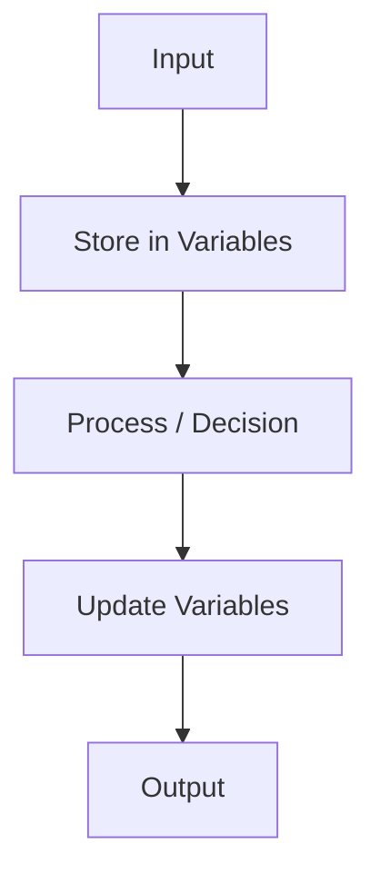
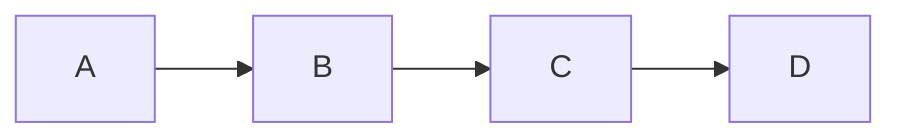
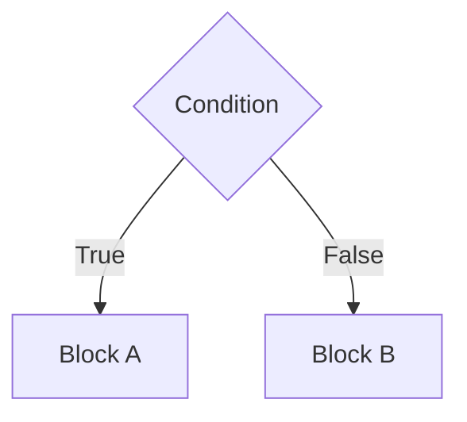
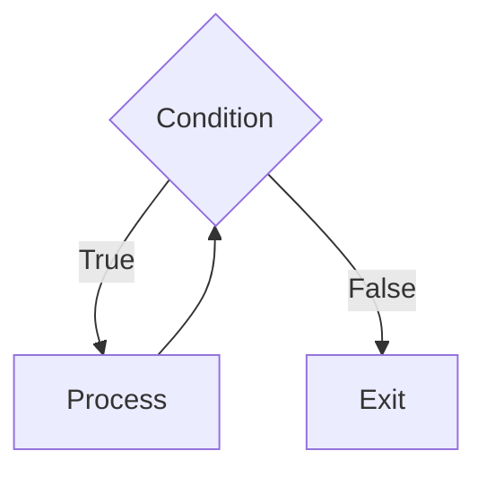
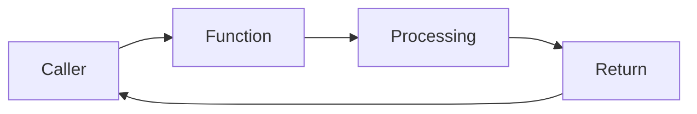

# Data Flow in Programming Languages

**Institution:** Rivers State University, Nkpolu-Oroworukwo, Port Harcourt
**Lecturer:** Dr. H. Okwu
**Course Code:** CMS 705
**Course Title:** Programming Languages
**Session:** 2024/2025

---

## Introduction

**Working on:** How data flows in a program.

- `#include <iostream>`
- `using namespace std;`

Data flows through:
1. **Variables**
2. **Assignments** — giving a value to a variable (`variable = value;`)
3. **Expressions** — anything that produces a value (e.g. `5 + 8`)
4. **Functions** — a block of code that performs a task

```cpp
return_type function_name() {
    // code
}
```

- **B. Parameter** — a value you give to a function so it can work with it.
- **C. Return value** — what a function sends back after finishing its work.
- **4. Control Structures**
- **5. Memory**

---

### Example: Basic Data Flow

```cpp
#include <iostream>
using namespace std;

int main() {
    int a = 5;    // input + storage (value stored in memory)
    int b = 8;    // input + storage
    int sum = a + b; // processing
    cout << sum;  // output
    return 0;
}
```

> The values `8` and `5` are first stored in memory. Then they are processed (added). Then the result is output. This is how data flows in the example above.

---

### Complete Data Flow Diagram



> Data flow is classified into two types: **Based on Program Execution** and **Based on Visibility**.

---

## Types of Data Flow Based on Program Execution

> Describes how data moves structurally through a program.

### 1. Sequential Data Flow

Data moves line by line in order: `A → B → C → D`



**Example:**

```cpp
#include <iostream>
using namespace std;

int main() {
    int x = 5;
    int y = 10;
    int result = x * y;
    cout << result << endl;
    return 0;
}
```

---

### 2. Conditional Data Flow (Branching)

Data flows depending on a condition.



**Example:**

```cpp
#include <iostream>
using namespace std;

int main() {
    int score = 18;
    string result;
    if (score >= 50) {
        result = "Pass";
    } else {
        result = "Fail";
    }
    cout << result << endl;
    return 0;
}
```

> Data flows differently depending on the condition.

---

### 3. Iterative Data Flow (Looping)

Data flows repeatedly or moves through a loop.



**Example:**

```cpp
int sum = 0;
for (int i = 1; i <= 5; i++) {
    sum += i;
}
cout << sum << endl;
return 0;
```

> The data `i` flows multiple times.

---

### 4. Procedural (Functional) Data Flow

Data moves between functions. It is the movement of data through:
- **Parameters** (input to function)
- **Local variables** (processing inside function)
- **Return value** (output from function)



**Note (in functional data flow):**
- Data moves between functions
- Each function performs a specific task
- Each function returns data
- No global variables used
- Data movement is **explicit** (clearly visible)

**Example — Grade Calculator:**

```cpp
#include <iostream>
using namespace std;

// Function to calculate total marks
int calculateTotal(int maths, int english, int science) {
    int total = maths + english + science;
    return total;
}

// Function to calculate average
double calculateAverage(int total) {
    double average = total / 3.0;
    return average;
}

// Function to determine grade
char determineGrade(double average) {
    if (average >= 70)
        return 'A';
    else if (average >= 60)
        return 'B';
    else if (average >= 50)
        return 'C';
    else if (average >= 45)
        return 'D';
    else
        return 'F';
}

int main() {
    int math    = 75;
    int english = 60;
    int science = 30;

    // Functional data flow begins
    int total        = calculateTotal(math, english, science);
    double average   = calculateAverage(total);
    char grade       = determineGrade(average);

    cout << "total: "   << total   << endl;
    cout << "average: " << average << endl;
    cout << "Grade: "   << grade   << endl;
    return 0;
}
```

> **Note:** When a parameter is passed to the program, it is called an **argument**.

---

## Types of Data Flow Based on Visibility

> A different description from program-execution types — describes **how** data movement is expressed in code. Two types:

### 1. Explicit Data Flow

- Data movement is **clearly written and visible**
- Data is passed as parameters, returned from functions, and assigned directly
- Happens when the programmer clearly shows how data moves

**Example — Add Two Numbers:**

```cpp
#include <iostream>
using namespace std;

int add(int a, int b) {
    int result = a + b;  // data processed
    return result;       // data returned
}

int main() {
    int x = 10;
    int y = 20;
    int sum = add(x, y);  // Explicit data flow
    cout << "sum = " << sum << endl;
    return 0;
}
```

> **Explanation:** `x = 10` and `y = 20` move into parameters `a` and `b`. Inside the function, `result = a + b`. `return result` moves value back to `main`, stored in `sum`.

**Example 2 — Multiply:**

```cpp
#include <iostream>
using namespace std;

int multiply(int x, int y) {
    return x * y;
}

int main() {
    int a = 4;
    int b = 8;
    int result = multiply(a, b);
    cout << result << endl;
    return 0;
}
```

> Note: Explicit data flow is clear, visible, and easy to trace and debug.

---

### 2. Implicit Data Flow

- Data movement happens **indirectly**, often through shared memory or global variables
- Data flow occurs through control structures and conditions, not directly through assignment
- **Not clearly visible** — flows "as data-as-value" through decisions or execution paths

**Example — Global Variable:**

```cpp
#include <iostream>
using namespace std;

int total = 0;  // global variable

void addToTotal(int value) {
    total = total + value;  // modifies global variable
}

int main() {
    addToTotal(10);
    addToTotal(20);
    cout << "total = " << total << endl;
    return 0;
}
```

> **Explanation:**
> - `total = 0` is a global variable
> - `addToTotal(10)` modifies the global variable
> - `addToTotal(20)` modifies the same global variable
> - `main()` prints total
>
> **Note:** Data can be retrieved without being passed between functions; hidden, data independence is small.

---

### Comparison: Explicit vs Implicit Data Flow

| Explicit Data Flow | Implicit Data Flow |
|---|---|
| Direct assignment | Through shared structure |
| Clearly visible in code | Hidden or hard to trace |
| e.g. `a = b; c = 5 + 0` | e.g. `if (a > 0) b = a + 0` |
| Easier to trace | Harder to trace |

---

### Example: Explicit and Implicit Together

```cpp
#include <iostream>
using namespace std;

int number = 0;  // implicit data flow (global)

int increment(int value) {
    number++;            // implicit (modifies global)
    return value + 1;   // explicit
}

int main() {
    int counter = 5;
    int nextNumber = increment(counter);
    cout << "Next Number = " << nextNumber << endl;
    cout << "counter = "     << counter    << endl;
    return 0;
}
```

> - `value = 5` → Explicit data flow
> - `cout <<` → Explicit data flow

---

## Data Flow in Memory

When a program runs, variables are stored in RAM. Two memory areas used between CPU:
- **Stack (local/primary memory)**
- **Heap (global memory)**

**Example — Memory Areas:**

```cpp
#include <iostream>
using namespace std;

int globalCounter = 100;  // stored in global area

int processData(int value) {
    int localVar = value * 2;   // stored in stack
    globalCounter += 10;        // modifies global area
    int* heapVar = new int(5);  // stored in heap
    *heapVar = localVar + 5;
    int result = *heapVar;
    delete heapVar;             // free heap memory
    return result;              // returned to caller
}

int main() {
    int number = 20;            // stored in stack
    int finalResult = processData(number);
    cout << "Final Result: "   << finalResult   << endl;
    cout << "Global Counter: " << globalCounter << endl;
    return 0;
}
```

---

## Importance of Data Flow in Programming Languages and Computer Science

> It is extremely important because:

1. It helps programmers understand how values move through a program
2. It helps detect logical errors
3. It helps in building large systems
4. It helps in writing secure systems
5. It helps in debugging
6. It is used in **compiler design**
7. It improves optimization of programs
8. It is fundamental in **algorithm design**
9. It is used in **systems engineering** (CSTs)

> **Note:** Data flow is a **core foundational concept** in computer science because it is important in:
> - Programming Languages
> - Compiler Design
> - Systems Engineering
> - Operating Systems
> - AI
> - Data Structures & Algorithms
> - Cyber Security
> - Parallel Programming
> - Static Analysis
> - Machine Learning
> - Database Systems
