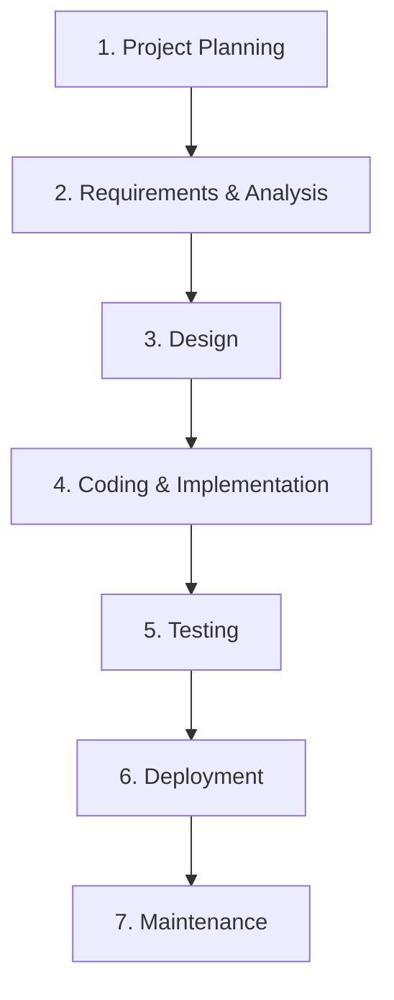
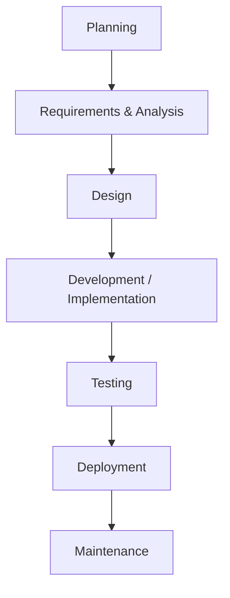
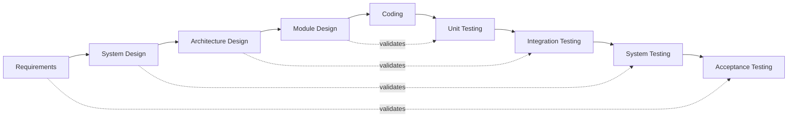
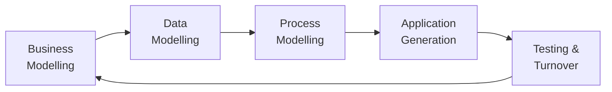
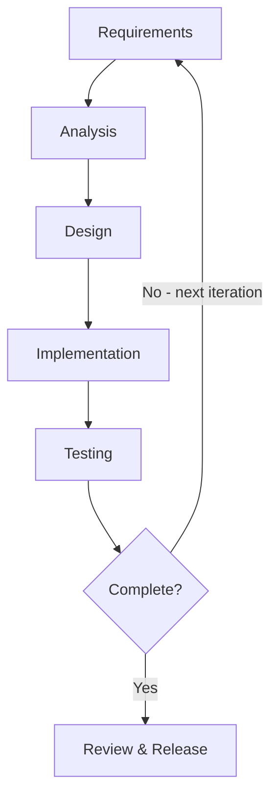
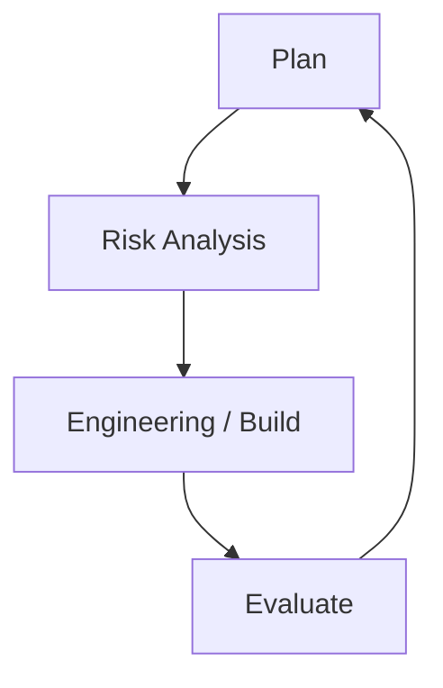

# System Development Life Cycle

---

## Learning Outcomes

At the end of this topic, students should be able to:

- Understand the System Development Life Cycle
- Describe the steps in SDLC
- Understand system development methodologies

---

## Introduction to SDLC

The **Systems Development Life Cycle (SDLC)** is like a house project or building a home where the first step is to come up with an idea (or the information system), then the idea is transformed into a drawing that is shown to the customer or owner of the project. This drawing or building plan undergoes several modifications or improvements till the customer agrees to the plan.

SDLC is the process of understanding how an **Information System (IS)** can support business needs by designing a system, building it, and delivering it to users. The key person in the SDLC is the **systems analyst**, who analyses the business situation, identifies opportunities for improvements, and designs an information system to implement them.

The SDLC has a similar set of **four fundamental phases**: planning, analysis, design, and implementation. However, different projects might adopt and emphasize different parts of the SDLC or approach the phases in different ways, but all projects have elements of these four phases.

Each phase is itself composed of a series of steps, which rely upon techniques that produce **deliverables** (specific documents and files that provide understanding about the project).

### Two Key Points About SDLC

i. The phases and steps through which IS projects move, and some of the techniques that produce certain deliverables.
ii. The SDLC is a process of **gradual refinement**.

> The deliverables produced in the analysis phase provide an insight to the shape of the new system. These deliverables are used as input to the design phase, which refines them to produce a set of deliverables describing in much more detailed terms exactly how the system will be built. These, in turn, are used in the implementation phase to produce the actual system.

System life cycle is an organizational process of developing and maintaining systems. It is a **step-by-step approach to solving business problems**. It helps in establishing a system project plan, because it gives an overall list of processes and sub-processes required for developing a system.

---

## Phases and Steps of SDLC

The stages of SDLC suggest a **four-phase and seven-steps** logical path of any project from start to finish. Project teams may move through the steps consecutively, incrementally, iteratively, or in other patterns.

**Four Phases:** Planning, Analysis, Design, Implementation

**Seven Steps:**

1. Project Planning
2. Requirements & Analysis
3. Design
4. Coding & Implementation
5. Testing
6. Deployment
7. Maintenance

---

## Phases of the SDLC — Summary Table

| Phase | Purpose | Activities | Deliverables |
|---|---|---|---|
| **Planning** | Define scope, objectives, and feasibility | Project Initiation, Feasibility Analysis, Project Scheduling & resource allocation | Project Charter, Feasibility Study Report, Project Plan |
| **Requirements & Analysis** | Gather detailed requirements and analyze business needs | Requirements Gathering (interviews, surveys, document analysis), Requirement analysis & documentation | System Requirements Specification (SRS), Use Cases, Process Diagrams |
| **Design** | Create detailed system designs based on requirements | System Architecture Design, Database Design, Interface Design | Design Documents, Data Models, UI/UX Prototypes |
| **Implementation (Development)** | Build and develop the system based on design specification | Coding, integration of system components, development of databases, creation of system interface | Source code, database schema, developed system modules |
| **Testing** | Ensure the system works as intended and is free of defects | Unit testing, Integration testing, System testing, User Acceptance Testing (UAT) | Test Plans, Test Cases, Test Scripts, Defect Reports |
| **Deployment** | Deliver the system to users and make it operational | System Installation, Data Migration, User Training, Deployment Testing | Deployed System, User Training, Deployment Planning |
| **Maintenance** | Monitor, support and enhance the system post-deployment | Bug Fixing, System Updates, Performance Tuning, New Feature Integration | Maintenance Reports, System Updates, Enhancement Specifications |

---

## System Development Methodologies

A **methodology** is a formalized approach to implementing the SDLC — it includes a list of steps and deliverables.

### Categories of System Methodologies

#### Process-Centred Methodology
Emphasizes **process models** as the core of the system concept. It focuses on business processes or the data that support the business.
- Example: Would focus first on defining the processes (e.g., assemble sandwich ingredients).

#### Data-Centred Methodology
Emphasizes **data models** as the core of the system concept. Would focus first on defining the contents of the storage areas (e.g., refrigerator) and how the contents were organized.

#### Object-Oriented Methodology
Attempts to balance the focus between process and data by incorporating both into one model. Would focus first on defining the major elements of the system (e.g., sandwiches, lunches) and look at the processes and data involved with each element.

---

## Structured Design

Structured design methodologies adopt a **formal step-by-step approach** to the SDLC that moves logically from one phase to the next.

Popular methods include:
- **Structured Analysis** — traditional method
- **Object-Oriented Analysis and Design** — widely used newer strategy

---

## SDLC Models

### Waterfall Model

The waterfall model is a **linear and sequential** design process in which progress is seen as flowing steadily downwards (like a waterfall).

- Each phase must be **completed before the next one begins**
- Possible to go backward (e.g., design → analysis), but extremely difficult

**Strengths:** Simple, easy to understand, well-suited for projects with clear requirements.

**Weaknesses:** Inflexible, difficult to accommodate changes, high risk if initial requirements are not well-understood.

**Best for:** Projects with well-defined requirements and low uncertainty.

---

### Validation and Verification Model (V-Model)

A **V-Model** is an extension of the Waterfall model that includes corresponding **testing phases for each development stage**.

- Emphasizes **verification and validation**
- Ensures **early detection of defects**
- Like Waterfall, can be rigid and challenging to handle changes

**Best for:** Projects where quality and reliability are critical.

---

### Rapid Application Development (RAD)

**RAD** is a software development methodology which favours **iterative development** and the **rapid construction of prototypes** instead of large amounts of up-front planning. It emerged in the 1990s.

- Planning is interleaved with writing the software itself
- Lack of extensive pre-planning allows software to be written much faster
- Makes it easier to change requirements

**Process:**
1. Develop preliminary data models and business process models using structured techniques
2. Verify requirements using prototyping to refine data and process models
3. Repeat iteratively until a "combined business requirements and technical design statement" is produced for constructing new systems

---

### Iterative Model

This model develops the system through **repeated cycles (iterations)**, allowing refinement through each iteration.

**Strengths:** Flexible, allows for changes and refinements, reduces risk through early iterations.

**Weaknesses:** Can lead to scope creep, requires careful project management.

**Best for:** Complex projects where requirements may evolve over time.

---

### Spiral Model

The **Spiral Model** combines **iterative development with risk assessment**. Each iteration involves planning, risk analysis, engineering, and evaluation.

Based on the unique risk patterns of a given project, the spiral model guides a team to adopt elements of one or more process models (incremental, waterfall, or evolutionary prototyping).

**Strengths:** Focuses on risk management, iterative refinement, and client feedback.

**Weaknesses:** Inability to manage complex projects simply, requires significant risk assessment expertise.

**Best for:** Large, high-risk projects where risk management is a priority.

> **[Full spiral diagram — see page 6]**
> _Original spiral image saved at `SDLC-pages/pages/page-6.png`._

---

### Agile Model

**Agile methodology** emphasizes flexibility, collaboration, and customer feedback. Uses iterative cycles called **sprints** to develop system increments.

**Strengths:** Highly flexible, adaptive to changes, focuses on customer satisfaction.

**Weaknesses:** Requires strong team collaboration, can be challenging in fixed-budget projects.

**Best for:** Dynamic projects where requirements are expected to change frequently.

---

### Other Methodologies

- Prototyping
- Extreme Prototyping
- DevOps
- Scrum

---

## System Analyst

A **system analyst** is a professional who specializes in analyzing, designing, and implementing information systems. They act as a **bridge between business problems and technology solutions**, ensuring that business needs are met with appropriate technical solutions.

System analysts work to:
- Improve system efficiency
- Integrate new technologies
- Enhance business processes through effective use of information systems

---

## Homework

Write on the **Roles and Responsibilities, Skills, and Types** of a System Analyst.

---

## Review Questions

i. Describe the major phases in SDLC. What are the deliverables of each phase?
ii. In what ways are the phases related?
iii. What major roles does the project manager and system analyst play in building an information system?
iv. What are the major roles played by the system analyst on a project team?
