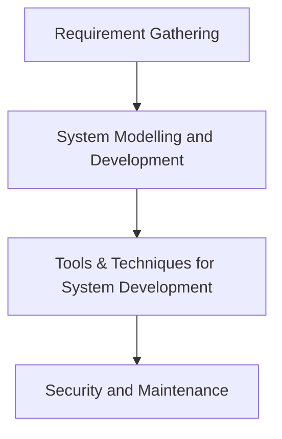

# System Analysis & Design

**Course:** CMS 711
**Lecturer:** Dr. Deedam
**Contact:** fortune.deedam@ust.edu.ng

---

## Overview of Systems and their Components

Systems are developed to solve a real-life problem. Systems are made up of **interdependent component units**.

Systems are created to solve problems. A system exists because it is designed to achieve one or more objectives. The term *system* is derived from the Greek word **Systema**, which means an organized relationship amongst functional units and components.

> **Definition 1:** A system is an organized collection of components that work together to achieve a specific or set of goals.

> **Definition 2:** A system is a set of interrelated elements that collectively work together to achieve some common goals.

Systems can be **natural, technological, social, environmental** etc., because every domain has sets of systems.

---

## Components of Every System

Components of every system are as follows: **Input, Process, Output, Feedback, Control, Boundary, Environment/Interface**.

### 1. Input
Input can be resources, data, or materials that enter into the system to be processed.
- Examples: raw data, user commands, energy, materials, etc.

### 2. Process
These are activities or operations that transform input into output.
- Examples: data processing, computation, manufacturing, steps or transformation of raw materials.

### 3. Output
Outputs are results produced by the system after processing the input.
- Examples: processed information, finished product report, decisions, etc.

### 4. Feedback
Feedback is information about the output of a system that is used to make adjustment or improvement through the input or the process.

### 5. Control
It involves the mechanism that monitors and regulates the operations of the system to ensure it achieves its goal.
- Examples: quality control process, management oversight, automated control systems, etc.

### 6. Environment
The environment encompasses everything outside the system that can influence its operations and performance.
- Examples: external data sources, regulatory constraints, economic conditions.

### 7. Boundaries
It defines the limits of the system and differentiates it from its environment.
- Examples: scope of a project, organizational boundaries, the perimeter of a manufacturing plant, the fence of your house.

### 8. Interface
The interface means the medium through which the users can interact with the system.

---

## Types of Systems

1. **Open System**
2. **Closed System**
3. **Manual System**
4. **Automated System**

- An **open system** interacts with the environment by receiving input and output — e.g., businesses, ecosystems, computer systems connected to the internet.
- A **closed system** does not interact with the environment. All input and output are contained within the system.
- A **manual system** is controlled by humans.
- An **automated system** is controlled by machines.

---

## Information System

**Information System** is a system that is designed to manage and process data to produce useful information within an organization. It is a set of interrelated components that stores, processes and distributes information, and supports decision making within the organization.

**Components of Information Systems:**
- Hardware
- Software
- People
- Data
- Network

---

## Introduction to System Analysis and Design

### System Development Life Cycle (SDLC)

---

## Requirements Gathering

**Requirements Gathering** is a crucial step in the System Development Lifecycle that involves collecting information from stakeholders to understand their needs and expectations for a new system and enhancements on an existing system.

The primary goal is to ensure the system meets the user requirements and provides value for the organization.

### What is a Requirement?

A requirement is simply a statement of what a system must do or what characteristics it must have.

- During **analysis**, requirements are written from the perspective of the business and focus on "who" of the system — these are called **Business Requirements**.
- During the **design phase**, business requirements evolve to become more technical and describe how the system will be implemented — these are called **System Requirements**.

---

## Types of Requirements

Requirements can either be **Functional** (user needs) or **Non-Functional** (system needs).

### Functional Requirements

A functional requirement relates directly to a process a system must perform or an information it needs to obtain. Functional requirements flow directly into creation of:
- Functional models
- Structural models
- Behavioral models

…that represent the functionality of an evolving system.

### Non-Functional Requirements

Non-functional requirements refer to the **behavioral properties** that the system must have, which deals with *how* the system would be developed.

---

## Requirements Gathering Techniques

The System Analyst is responsible for gathering requirements using a variety of techniques that ensure the current business processes and needs of the new system are well understood before moving into design.

**Techniques include:**
- **Interviews** — structured or unstructured conversations with stakeholders
- **Questionnaires** — paper-based or electronic (e.g., Google Forms)
- **Joint Application Techniques (JAD/RAP)** — collaborative workshops
- **Brainstorming** — group idea generation sessions
- **Workshops** — structured group sessions

---

## Task / Assignment

**Gather/Analyse the functional and non-functional requirements of the following three systems:**

1. Enhanced Student Information Management System
2. Enhanced E-Commerce Application Platform
3. A Customer Relationship Management System
