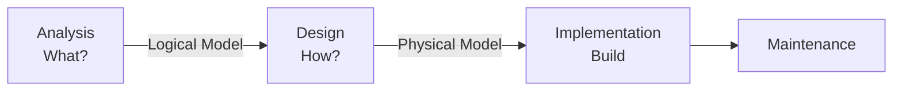
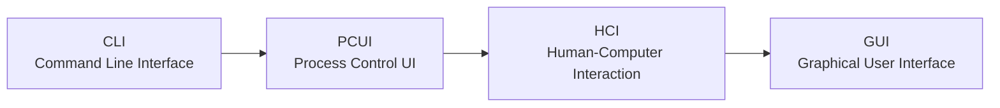

# Introduction to System Design and Interface Design

---

## Part 1: Introduction to System Design

### Learning Outcomes

At the end of this topic, students should be able to:

- Describe System Design (SD)
- Describe the approaches in the Design Phase

---

### What is System Design?

**System Design (SD)** is the process of planning a new system or replacing or complementing an existing or legacy system. The system design phase introduces/defines the system outputs, inputs, interface, dialogue and data requirements. After the analysis and design phases, the proposed system enters the implementation and maintenance phase.

> The purpose of **analysis** is to figure out *what* the business needs are.
> The purpose of **design** is to decide *how* to build the system.
> The goal of design is to create a **blueprint** for the system that can be implemented.

---

### What vs. How

| Phase | Focus | Output |
|---|---|---|
| **Analysis** | *What* the business needs — functional requirements | Logical Model |
| **Design** | *How* to build the system — non-functional requirements | Physical Model |

**Analysis Phase Deliverables:**
- Product Requirement Document
- Architectural Diagrams (high-level composition)
  - Data Flow Diagram (DFD)
  - Database Design (DD)
  - Entity Relationship Diagram (ERD)
  - Flowcharts
  - Process Flow Diagrams

**Design Phase Deliverables:**
- Output, Input, File Design
- Process Flow Diagrams
- Architectural Diagrams (high-level representation)

The design phase is a **transition from a user-oriented document to a programmer-oriented document**.

**Major considerations during design:**
1. How will the existing system be integrated?
2. What are the processes of converting data from **legacy systems** (outdated computing systems including hardware, software, file formats, and programming language)?
3. Leveraging skills that exist in-house or outsourcing skills.

Design involves the user interface, system input, system outputs, and processes — which can be organized centralized to a location, distributed, or both.

---

### Tools and Techniques for System Design

- Flowcharts
- Data Flow Diagram (DFD)
- Database Design
- Architectural Diagrams
- Input-Process-Output Specifications

---

### Approaches in the Design Phase

There are two approaches: the **general/preliminary approach** and the **structured/detailed approach**.

#### General Approach
The features of the new system are specified, and the cost of implementing these features and the benefits to be derived are estimated.

#### Structured or Detailed Approach
A blueprint of a computer system solution to a given problem, having the same components and inter-relationships as the original problem. It specifies:
- Input
- Output
- Database
- Forms
- Codes
- Processing

---

### General Guidelines for Systems Design

**Goal of Systems Design — build a system that is:**

- **Effective** — satisfies defined requirements
- **Reliable** — handles errors optimally
- **Maintainable** — well designed, flexible, and considers future modifications

**In the design approach, consider in this order:**
1. **Users**
2. **Data**
3. **Processing**

---

## Part 2: Interface, Input and Output Design

### Learning Outcomes

At the end of this topic, students should be able to:

- Understand the process of user interface design
- Understand how to design the user interface structure and standards
- Be able to design a user interface

---

### What is a User Interface?

A **user interface** is the part of the system users interact with. The interface includes:
- Screen displays
- Forms for capturing data
- Reports (output) that the system produces

> To the user of the system, **the interface is the system**.

The **interface design** is the process of defining how a system will interact with external entities (customer, supplier, and other systems). The analyst should design the human element such that end users find the system friendly to work with.

**User Interface Design is the 4th step in the SDLC.**

---

### Significant Criteria for Dialogue Type Evaluation

- **Easy to Use** — easy even for inexperienced users
- **Easy to Learn** — easy for users to remember
- **Processing and responding speed**
- **Easy to develop**

---

### Parts of a Design Interface

Most design interfaces comprise the following parts:

#### i. Navigation Mechanism
Enables the user to interact with the system and tells it what to do (e.g., buttons, menus).

#### ii. Input Mechanism
The way in which the system captures information (e.g., using forms for adding or updating information).

#### iii. Output Mechanism
The way in which the system provides information to the user or other external systems (e.g., reports, webpages).

> Navigation design, input design, and output design are **tightly coupled** and must be performed in an **incremental and iterative** manner, especially in GUI-based displays.

---

### Principles of User Interface Design

| Principle | Description |
|---|---|
| **Layout** | Use a consistent format for menu, command input, and data display (e.g., top area for commands/navigation, middle for input/output, bottom for status) |
| **Content Awareness** | Users should always be aware of where they are in the system and what information is being displayed |
| **Aesthetics** | Maintain consistency between information display and data input; careful use of space, colours, and fonts |
| **User Experience** | Ease of use and ease of learning should be the central goal; fit the interface to the person, not the person to the interface |
| **Consistency** | Enables users to predict what will happen before they perform a function; critical for ease of learning, use, and aesthetics |
| **Minimal User Effort** | Interface should be simple; provide undo/reversal functions; no more than three mouse clicks from the starting menu to task completion |

---

### Essential Instructions in Dialogue Design

- **Feedback information** — provide users with information on what is being done
- **Status** — keep users informed of the system's parts they are using
- **Escape** — allow users to exit from a manipulation
- **Minimum tasks** — avoid users making too many manipulations
- **Default** — set the frequently used parameter
- **Support** — provide users with necessary supporting information
- **Cancel** — users can cancel and resume
- **Consistency** — implementation of commands must be consistent via the interface

---

### Screen Design

The most important thing is that displayed information, commands, and notices of system status go in line with each other, arranged in priority order and comfortable to users.

**3 Main Types of Display:**

1. **Menu Display** — helps users in fast connecting and easy access to system's functions
2. **Dialogue Display** — consists of notices/dialogues between users and the system
3. **Data Entry Display** — organizes data in groups of information classified by changeability, frequency of use, and importance. Designers decide whether to use simple or master-detail data entry display.

---

### UI Design — Evolution

- **CLI (Command Line Interface)** — typing commands at a prompt
- **PCUI (Process Control User Interface)** — early form of process control
- **HCI (Human-Computer Interaction)** — user-centred systems
- **GUI (Graphical User Interface)** — responsive, easy to use and learn

---

### Steps for Designing an Interface

#### 1. Design a Transparent Interface
- Must meet design objectives
- Must improve user efficiency and productivity
- Use standard commands that are easy to remember (e.g., Open, Save, Save As)

#### 2. Create an Interface That is Easy to Learn and Use
- Clearly label all controls, buttons, and icons
- Show commands as a list of menus (e.g., Home, File, Insert, Draw, Design)
- Provide on-screen instructions that are logical and clear
- Make it easy to navigate

#### 3. Enhance User Productivity
- Ensure a **Help menu** is always available for online and offline help
- Provide **shortcuts** for experienced users (keyboard or text shortcuts)
- Organise tasks and functions by grouping them based on business operations

#### 4. Minimize Input Data Problems
- Create **input masks** (e.g., date format: `dd/mm/yy`)
- Build rules to enforce **data integrity** via data validation
- Inform users if tasks were completed successfully
- Provide progress indicators (e.g., "Step 1 of 4" or a progress bar)

---

### Data Validation Techniques

When data is captured and entered, it should be **valid**. The following validation checks must be in place:

| Validation Check | Description |
|---|---|
| **Presence Check** | Is the data present in the field? |
| **Range Check** | Is the data within a set range? (e.g., months: 1–12) |
| **Length Check** | Is the text too short or too long? |
| **Type Check** | Is the data in the correct data type? (e.g., numeric fields must not accept text) |
| **Format Check** | Is the data in the correct format? (e.g., date as `dd/mm/yy`) |
| **Consistency Check** | Ensure combinations of data are valid |
| **Database Check** | Compare data against a database/file to ensure correctness |

> **[Figure 1 — Example data validation check form]**
> _UI screenshot saved at `IntroSystemDesign-pages/pages/page-07.png`._

---

### Data Verification Techniques

Data validation only checks whether data is **sensible** — it does not confirm it is the **correct** value.

**Example:**
- Correct date of birth: `12/11/1982`
- Date entered: `12/11/1928` → passes validation (valid date), but is wrong

There are **two methods** of data verification:

#### 1. Proof Reading
After data has been entered, it is compared against the original source. Quick and simple but doesn't catch every mistake.

#### 2. Double-Entry
Data is entered twice (preferably by two different users). The computer compares both entries — if they do not match, an error is generated.
- Takes more time and effort but catches almost every mistake
- Common example: typing a new password twice for confirmation

> **[Figure 2 — Double data entry verification check]**
> _UI screenshot saved at `IntroSystemDesign-pages/pages/page-08.png`._

---

### Control Functions

On-screen forms have a variety of **controls** that guide how each data item is linked to an input field.

#### Types of Controls

**Text Box** — for normal text input. Labels placed to the left; supports standard GUI functions (cut, copy, paste).

**Number Box** — for entering numbers, including date data. Avoid if a selection box can be used instead.

**Selection Box** — enables the user to select a value from a predefined list. Items arranged in meaningful order (alphabetical or most-used). Can be initialized as unselected.

**Buttons** — perform actions (e.g., Save, Submit, Cancel).

#### Types of Selection Boxes/Buttons

| Type | Description |
|---|---|
| **Check Box** | Used when several items can be selected from a list; square box in front of each option |
| **Radio Buttons** | Used to select one option from a mutually exclusive list; circle in front of each option |
| **Drop Down List Box** | Used when there is insufficient room to display all choices |

---

## Output Design

One of the major reasons for building an information system is the **output** — the visible part of the system. Results of processing can be viewed on screen, on paper, or via the Web.

### Considerations in Output Design

- What is the **purpose** of the output?
- Are there **specific pieces of information** that should be included?
- In what ways will the output be **presented**? (On-screen or printed)
- Are there **security or confidentiality** issues?

### Output Design Principles (HCI)

- Notes, headings, and output formats should be **standardized** whenever possible — format consistency is an attribute of user-friendly output
- The arrangement of information should be **logical** — present in digestible "chunks" in easy-to-understand language
- **Avoid acronyms and abbreviations** especially for novice users; define unfamiliar words
- **Algorithms and assumptions** on which calculations are based should be available to users — ensures correct interpretation
- Users should be able to **locate needed data quickly** without searching through all data

---

### Designing System Outputs

There are two basic output types:

#### 1. On-Screen Reports
Like designing an on-screen form. Types include:
- Detail reports
- Summary reports
- Exception reports
- Turnaround documents
- Graphs

**Design considerations:**
- Show all necessary fields
- Have fields that are the right size for the data
- Provide easy-to-understand instructions (if needed)
- Make good use of colours and fonts to make data clear
- Make good use of the available screen area

> Most organizations have moved toward electronic reports (e.g., **PDF format** stored on file/web servers for easy access).

#### 2. Printed Reports
Like designing an on-screen report, but must fit a piece of printer paper. Includes:
- Page numbers
- Headers/footers

---

## Review Questions

i. What are the key tasks in input design?
ii. How is data entered into a computer system?
iii. On-screen forms can have a variety of controls. Name and briefly discuss any **four** of them.
iv. Name and explain any **two data verification** and **two data validation** techniques.
v. What factors should be considered while designing the output of a system?
vi. What is the relationship between user interface design and requirements determination?
